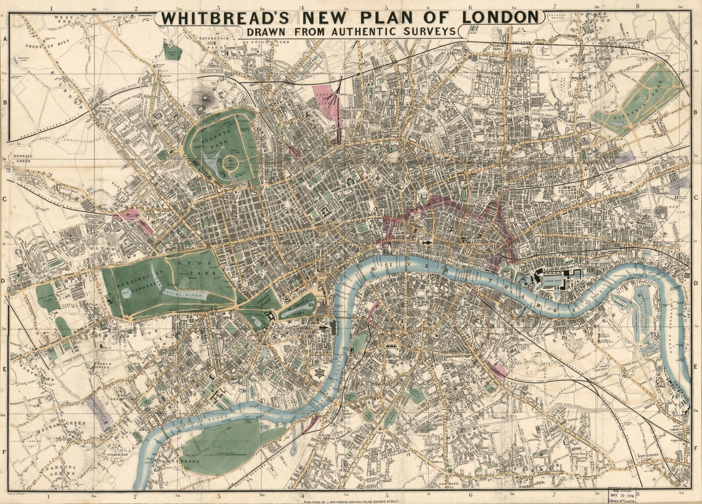
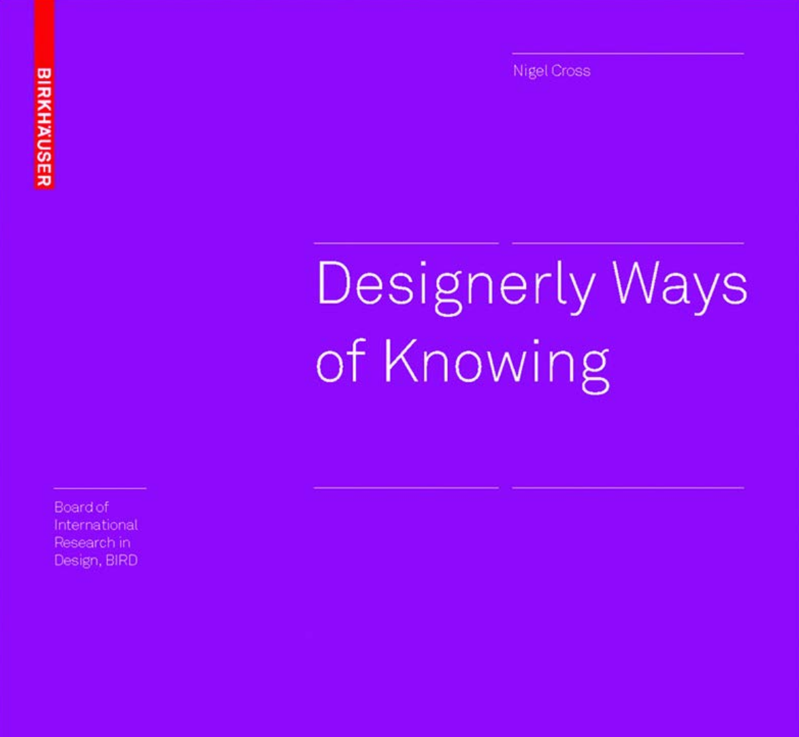

- title: Learning from architecture and design | Programming language design (NPRG075)

*****************************************************************************************
- template: title

# NPRG075
## Learning from architecture and design

---

**Tomáš Petříček**, 309 (3rd floor)  
_<i class="fa fa-envelope"></i>_ [petricek@d3s.mff.cuni.cz](mailto:petricek@d3s.mff.cuni.cz)  
_<i class="fa-solid fa-circle-right"></i>_ [https://tomasp.net](https://tomasp.net) | [@tomaspetricek](http://twitter.com/tomaspetricek)

**Lectures:** Monday 12:20, S7  
_<i class="fa-solid fa-circle-right"></i>_ https://d3s.mff.cuni.cz/teaching/nprg075

*****************************************************************************************
- template: subtitle

# Design and architecture
## Solving complex problems

-----------------------------------------------------------------------------------------
- template: image

# Architecture and urban planning

Understanding and solving complex problems

Organizing large number of diverse entities

**Useful concepts and methodologies?**

-----------------------------------------------------------------------------------------
- template: image
- class: smaller

# Software architecture

**How to organize systems?**

How can we study what organization makes sense?

How languages and tools shape organization?

How systems grow as requirements change?

-----------------------------------------------------------------------------------------
- template: content
- class: two-column

# Urban planning

### *fa-tree-city* Jacobs on cities

**Problems of simplicity**  
Fully analyzable

**Unorganized complexity**    
Statistically analyzable

**Organized complexity**  
Non-reducible

---

### *fa-rocket* Parnas on software

**Analogy systems**  
Continuous models

**Repetitive digital**  
Reduce via abstraction

**Non-repetitive digital**  
Non-reducible

-----------------------------------------------------------------------------------------
- template: lists
- class: smaller

# Design problems

## Design problems are ill-defined

- Full information never available
- Cannot be exhaustively analyzed
- No correct solution may exist

## Solving design problems

- Conjectured solution reframes the problem
- Designers impose "primary generator"
- Change problem-as-given in light of solution

-----------------------------------------------------------------------------------------
- template: content
- class: three-column

# Achieving fit

### Vernacular

Adaptation over generations

---

### Modernist

Problem analysis and fresh design

---

### Post-modern

Prefers cleverness, humour over fit!

*****************************************************************************************
- template: subtitle

# Design patterns
## Learning from architecture

-----------------------------------------------------------------------------------------
- template: content

x

* Existing inspiration
  - GoF patterns

* Design patterns, revisited
  - achieving fit for complex problems
  - seeking "quality without a name"
  - pattern language = sequence of simple patterns to follow
  - pattern - resolves forces; contributes a bit to the answer
  - where do they come from?

*****************************************************************************************
- template: subtitle

# Notebook systems
## Design for a complex problem

-----------------------------------------------------------------------------------------
- template: lists
- class: smaller

# Case study: FT

## x

- xx
- xx
- [tinyurl.com/nprg075-ft](https://github.com/ft-interactive/recycling-is-broken-notebooks)

## xx

- xx
- xx

-----------------------------------------------------------------------------------------
- template: content

Notebooks
  - DEMO: Doing something in F# in a notebook
  - read jollity
  - look at some of the examples
  - Q: what are some forces (different in normal PLs)?
  - Q: how are they reflected?
  - Q: what are some badly addressed forces?

*****************************************************************************************
- template: subtitle

# Pattern languages
## Designing exploration tools

-----------------------------------------------------------------------------------------
- template: content

Exploratory workspace pattern language
  - what is this about?
  - what is the structure of the language/pattern (env + interaction ctx)
  - Conversation in context
    - forces
    - diagram (how it resolves)
  - More patterns
  - one or two examples

-----------------------------------------------------------------------------------------
- template: content

where patterns come from???

Screenshots - command line, Smalltalk/Squeak, Jupyter
exploratory programming -
as conversation with the "workspace"
difficult to find effective ways of working / patterns
  (or port them from one environment to another)
pattern language
  key pattern "Conversation in Context"

-----------------------------------------------------------------------------------------
- template: content

> you working on a project in
an environment while continually switching between di;erent interaction contexts

context-problem-solution / forces

environment (ACTIVE) - many languages (some PLs)
  with boundaries; can be nested

interaction context (PASSIVE)
  contains objects, files, structured in contexts (may need to do work to find it)

SCREENSHOT - p8/9 Q&A format

Conversation in context
FORCES
- difficult to find the place where to ask
- difficult to find the right words for asking the Q
- difficult to understand technical or complex answer
SOLUTION
- engage with environment interactively, revise to clarify, unpack complexity, iterate wording

ELABORATE INQUIRY
decompose conversation into parts to manage complexity (Linux pipes)
COACH YOUR ENVIRONMENT
extend the interaction context (define helpers, add things to variable scope)
CONCEPT IN SHARDS
PROXY TRANSPORT
SIMPLE RESPONSE
TANGIBLE RESPONSE
PAUSE AND EXPLORE

*****************************************************************************************
- template: subtitle

# Concepts and methods
## Learning from architecture

-----------------------------------------------------------------------------------------
- template: content

Other ideas
  - *sources*
  - what works despite theory (information hiding)
  - learning from outliers (10 PRINT)
  - conceptual coherence --> worst is better
  - post-modernism --> Perl / Noble

* What is left
  - navigation?
  - materials that age well?
  - vernacular architecture?

*****************************************************************************************
- template: subtitle

# Conclusions
## Designing programming systems

-----------------------------------------------------------------------------------------
- template: content

* Conclusions
  - as idea generation
  - as evaluation - tricky
  - very conceptual  

-----------------------------------------------------------------------------------------
- template: content
- class: condensed

# References

- Parnas, D. L. (1985). Software aspects of strategic defense systems. Communications of the ACM, 28(12), 1326-1335.
- Jacobs, J. (1961). The Death and Life of Great American Cities. Random House.
