- title: Learning from architecture and design | Programming language design (NPRG075)

*****************************************************************************************
- template: title

# NPRG075
## Learning from architecture and design

---

**Tomáš Petříček**, 309 (3rd floor)  
_<i class="fa fa-envelope"></i>_ [petricek@d3s.mff.cuni.cz](mailto:petricek@d3s.mff.cuni.cz)  
_<i class="fa-solid fa-circle-right"></i>_ [https://tomasp.net](https://tomasp.net) | [@tomaspetricek](http://twitter.com/tomaspetricek)

**Lectures:** Monday 12:20, S7  
_<i class="fa-solid fa-circle-right"></i>_ https://d3s.mff.cuni.cz/teaching/nprg075

*****************************************************************************************
- template: subtitle

# Design and architecture
## Solving complex problems

-----------------------------------------------------------------------------------------
- template: image

# Architecture and urban planning

Understanding and solving complex problems

Organizing large number of diverse entities

**Useful concepts and methodologies?**

-----------------------------------------------------------------------------------------
- template: image
- class: smaller

# Software architecture

**How to organize systems?**

How can we study what organization makes sense?

How languages and tools shape organization?

How systems grow as requirements change?

-----------------------------------------------------------------------------------------
- template: content
- class: two-column

# Urban planning

### *fa-tree-city* Jacobs on cities

**Problems of simplicity**  
Fully analyzable

**Unorganized complexity**    
Statistically analyzable

**Organized complexity**  
Non-reducible

---

### *fa-rocket* Parnas on software

**Analogy systems**  
Continuous models

**Repetitive digital**  
Reduce via abstraction

**Non-repetitive digital**  
Non-reducible

-----------------------------------------------------------------------------------------
- template: lists
- class: smaller

# Design problems

## Design problems are ill-defined

- Full information never available
- Cannot be exhaustively analyzed
- No correct solution may exist

## Solving design problems

- Conjectured solution reframes the problem
- Designers impose "primary generator"
- Change problem-as-given in light of solution

-----------------------------------------------------------------------------------------
- template: content
- class: three-column

# Achieving fit

### Vernacular

Adaptation over generations

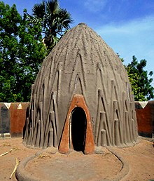

---

### Modernist

Problem analysis and fresh design

---

### Post-modern

Prefers cleverness, humour over fit!

*****************************************************************************************
- template: subtitle

# Design patterns
## Learning from architecture

-----------------------------------------------------------------------------------------
- template: image
- class: smaller

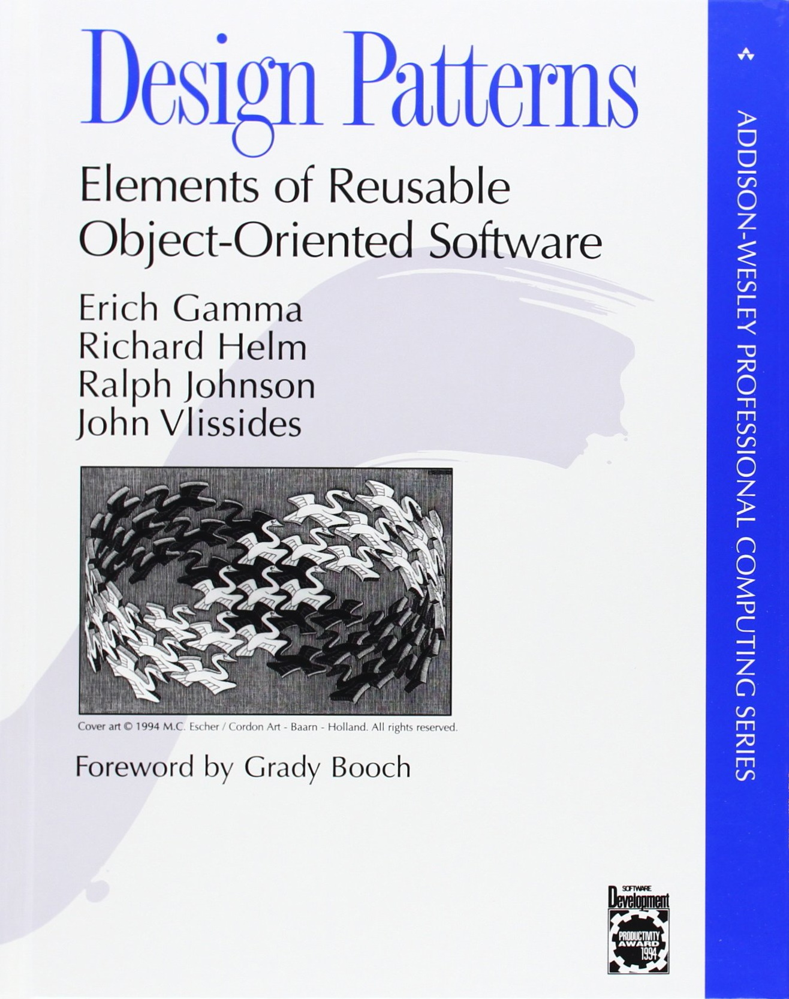

# Design patterns

Based on Christopher Alexander's work on architecture

**Useful but criticized**

Missing the point of Alexander's work

Workarounds for coding  
in a poor language

-----------------------------------------------------------------------------------------
- template: image
- class: smaller

# Quality without name

**A system has it when  
it is true to its inner  
forces, when it is free  
from contradictions**

Each "living" pattern resolves a system of forces. When all forces  
are resolved, the quality appears.

-----------------------------------------------------------------------------------------
- template: lists
- class: smaller

# Why is it hard?

## Vernacular method

- Shared language lost from community
- Complexity of problems has grown
- Community cannot build a skyscraper

## Modernist method

- Cannot perfectly analyze problem
- Always misses some important detail
- Keeps reinventing imperfect forms

-----------------------------------------------------------------------------------------
- template: icons

# Quality
## How is this about programming?

- *fa-keyboard* Think about programmer thinking and coding
- *fa-computer-mouse* Programming systems, not languages
- *fa-arrows-to-circle* Need to resolve complex systems of forces
- *fa-list-check* Patterns to capture approaches that work

-----------------------------------------------------------------------------------------
- template: lists
- class: smaller

# Achieving fit

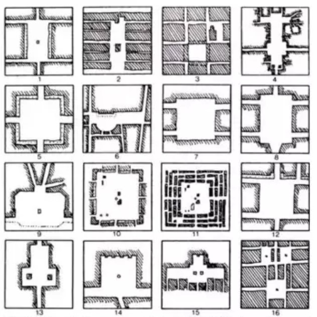

## Design pattern

- Context, problem, forces, solution
- Resolves interconnected forces
- Works as a solution template

## Pattern language

- Ordered sequence of patterns
- Can be followed step-by-step
- Ideally shared and agreed on

-----------------------------------------------------------------------------------------
- template: image
- class: smaller

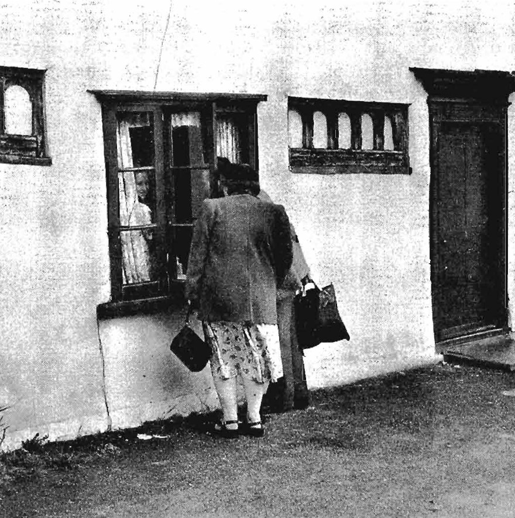

# Degrees of publicness

**Context:** Where people want to live is different

**Forces:** Some want to live where the action is, some in more isolation

**Problem:** How to organize a cluster of homes?

**Solution:** Distinguish private homes, public homes and in-between

*****************************************************************************************
- template: subtitle

# Notebook systems
## Designing a complex system

-----------------------------------------------------------------------------------------
- template: image

# Notebook systems

**Literate programming environment - code, outputs, comments**

Used for exploration, scientific tasks, data science, learning

**How to design exploration environment?**

-----------------------------------------------------------------------------------------
- template: subtitle

# Demo
## Using F# in a notebook system

-----------------------------------------------------------------------------------------
- template: lists
- class: smaller

# Case study: Notebooks

## Notebooks for data science

- Use by FT journalists for article
- Start with "Eurostat exports data"
- [tinyurl.com/nprg075-ft](https://github.com/ft-interactive/recycling-is-broken-notebooks)

## Design questions

- What are the specific forces?  
- How are they reflected in the notebooks?
- Which are poorly resolved?

*****************************************************************************************
- template: subtitle

# Pattern languages
## Designing exploration tools

-----------------------------------------------------------------------------------------
- template: image
- class: noborder

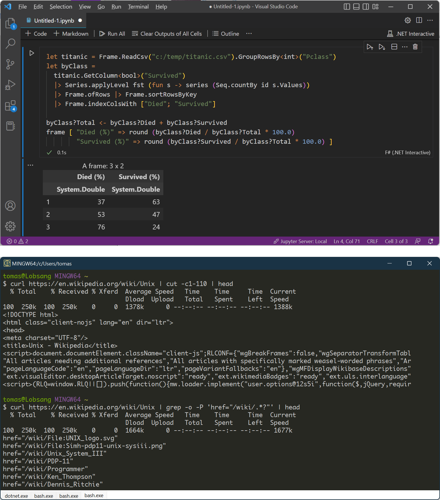

# Exploratory programming workspaces

Environment that lets you figure something out interactively..

Data science, but also general programming

**Are there common patterns of working?**

-----------------------------------------------------------------------------------------
- template: lists
- class: smaller

# Taeumel et al. (2022)

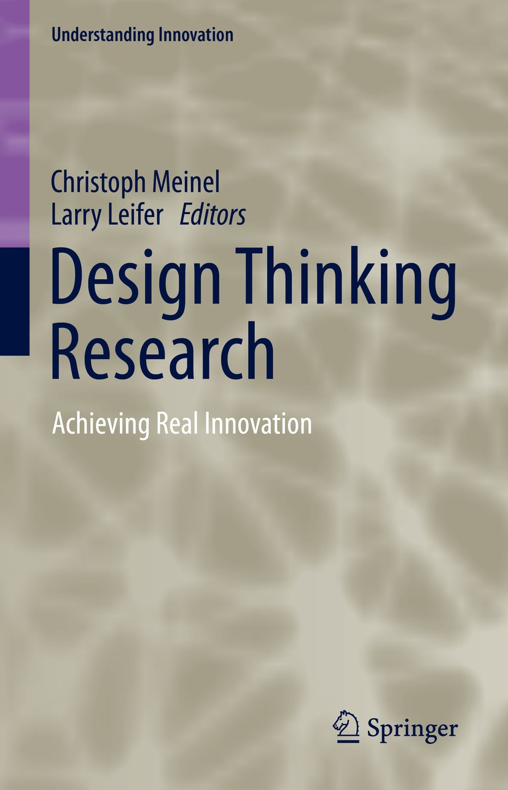

## A Pattern Language of an Explora- tory Programming Workspace

- Patterns in exploratory tools
- Smalltalk, notebooks, UNIX
- System design and ways of using

## Conversation in context

- Seven patterns covering three aspects
- Questions, context, responses
- Capture needs, forces, structure, trade-offs, etc.

-----------------------------------------------------------------------------------------
- template: image
- class: noborder smaller

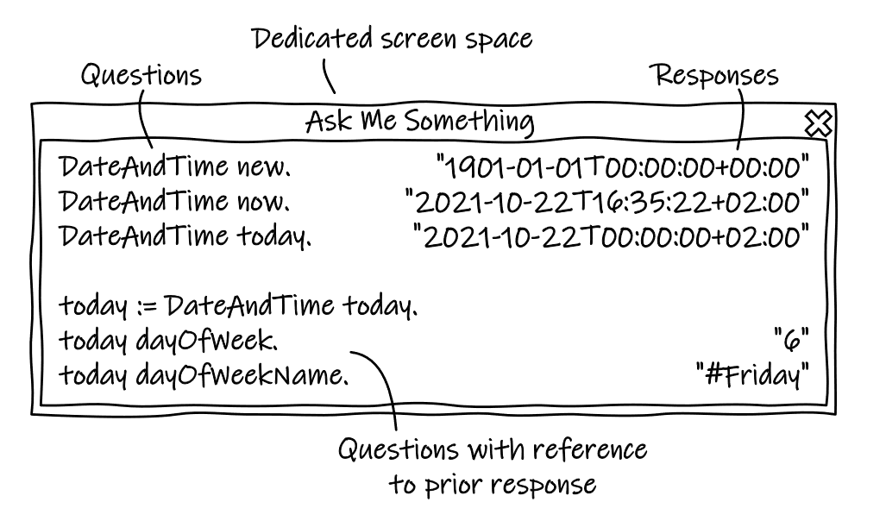

# Programmer, environment, interaction context

> "It is all about you working on a project in
> an environment while continually switching
> between different interaction contexts"

-----------------------------------------------------------------------------------------
- template: icons

# Conversation in context
## Forces resolved by the pattern

- *fa-circle-question* Want to ask question about something
- *fa-map* Finding the right place to ask
- *fa-language* Finding the right words to use
- *fa-atom* Understanding complex technical answer

-----------------------------------------------------------------------------------------
- template: image
- class: noborder

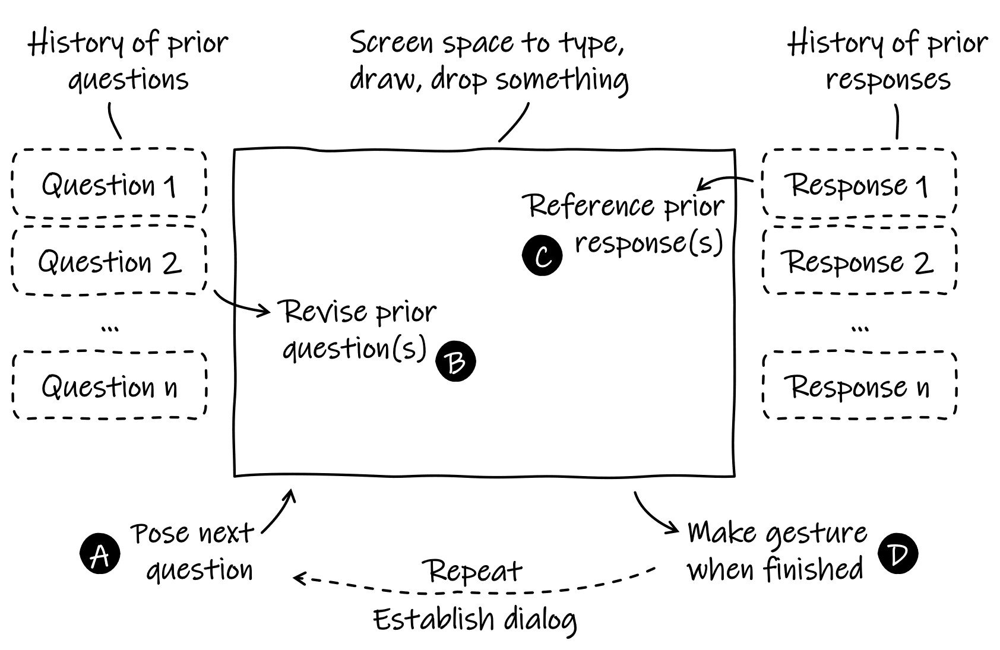

# Conversation in context

**Solution structure**

Iterative question and answer interaction with persistent context

Support for revising questions asking follow-up questions

-----------------------------------------------------------------------------------------
- template: lists

# Further patterns

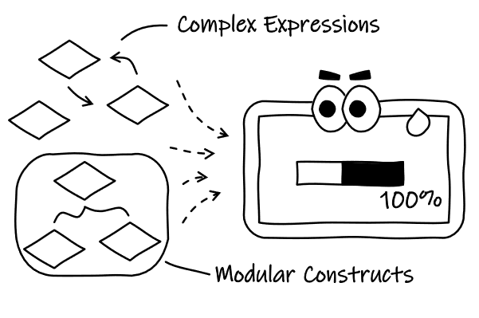

## Elaborate inquiry

- Difficult to ask complex questions
- Use stepwise composition
- Refer to previous answers

## Proxy transport

- Need to access external information
- May be big or use an odd format
- Embed into local context with lazy loading

-----------------------------------------------------------------------------------------
- template: icons

# Further patterns
## Context, forces, solution

- *fa-folder-open* **Coach your environment** by adding information
- *fa-diagram-project* **Concepts in shards** need to be linked
- *fa-bullseye* **Simple response** to be found iteratively
- *fa-search* **Pause and explore** to better understand

*****************************************************************************************
- template: subtitle

# Pattern languages
## Designing pattern languages

-----------------------------------------------------------------------------------------
- template: image
- class: noborder

# Where patterns come from?

----

**Pattern languages  
for creating  
pattern languages**

----

No single systematic method that would always work

-----------------------------------------------------------------------------------------
- template: icons

# Pattern writing
## Where patterns come from

- *fa-igloo* Shared and evolved in a community
- *fa-computer* Repeated solutions in past software systems
- *fa-user-ninja* Personal experience with a problem
- *fa-cloud* Focused group collaboration (origins of wiki!)

-----------------------------------------------------------------------------------------
- template: image
- class: noborder

# A pattern language for pattern writing

(Meszaros+Doble, '97)

**How to structure, write and present patterns & pattern languages**

-----------------------------------------------------------------------------------------
- template: image
- class: noborder

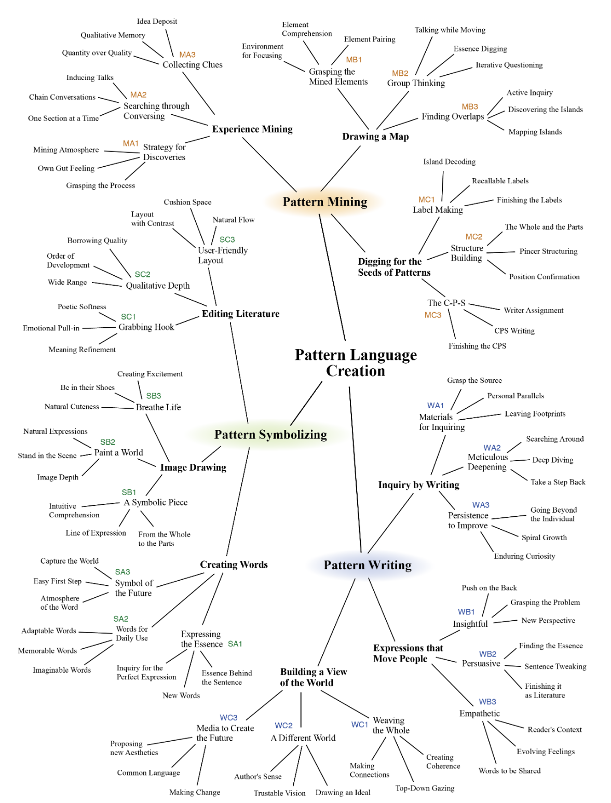

# A pattern language for creating pattern languages

(Iba+Isaku, 2016)

**Hints on  pattern mining**

Collect experiences
Map and find overlaps
Structure in clusters

-----------------------------------------------------------------------------------------
- template: icons

# Practical tips
## How to write a pattern language

- *fa-arrows-to-circle* Patterns are about resolving forces
- *fa-table* Patterns should have fixed format
- *fa-file* Context, forces, structure, related patterns
- *fa-user-gear* System structure or human interaction with it

*****************************************************************************************
- template: subtitle

# Concepts and methods
## Learning from architecture

-----------------------------------------------------------------------------------------
- template: image

# Learning from unaverage clues

(Jacobs, 1961)

Cannot reduce city  
to a single statistic

**Look for informative singleton clues!**

-----------------------------------------------------------------------------------------
- template: subtitle

# Demo
## Commodore 64 BASIC

-----------------------------------------------------------------------------------------
- template: lists
- class: smaller tenprint

# 10 PRINT CHR$(205.5+RND(1)); : GOTO 10

## Technical aspects

- Edit & run in one terminal
- Line numbers for navigation
- Simple with `POKE` for hackers

## Social aspects

- Path from a user to a programmer
- Commodore 64 boots into BASIC!
- Learn by copying from magazines

-----------------------------------------------------------------------------------------
- template: image

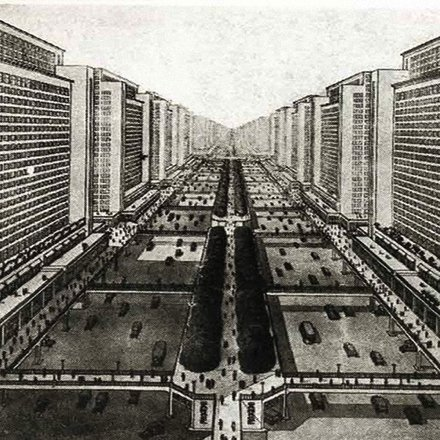

# What works despite the theory

(Jacobs, 1961)

Elegant theories  
that are convincing  
but do not work

**Document what actually works in practice instead!**

-----------------------------------------------------------------------------------------
- template: lists
- class: smaller

# Information hiding

## Good software engineering

- Divide systems into modules
- Hide implementation details
- Expose only what is needed

## Why should this work?

- Basic principle of OOP!
- Can freely change internals
- Modules developed independently

-----------------------------------------------------------------------------------------
- template: lists

# Information hiding

## Brief history

- Decomposing systems (1972)
- IBM OS/360 development (1975)
- Brooks' reflections (1995)
- Cathedral and the bazaar (1999)

## Critique and alternatives

- Design is hard to anticipate
- Cumbersome & inefficient uses
- MIDI SysEx and UNIX DWARF work!

-----------------------------------------------------------------------------------------
- template: image
- class: smaller

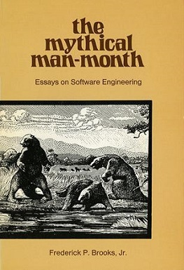

# Conceptual coherence

(Brooks, 1975)

A clean, elegant programming product
must present to each of its users a coherent mental model of the
application.

**Conceptual integrity  
is the most important factor in ease of use.**

-----------------------------------------------------------------------------------------
- template: lists
- class: smaller

# Post-modern programming

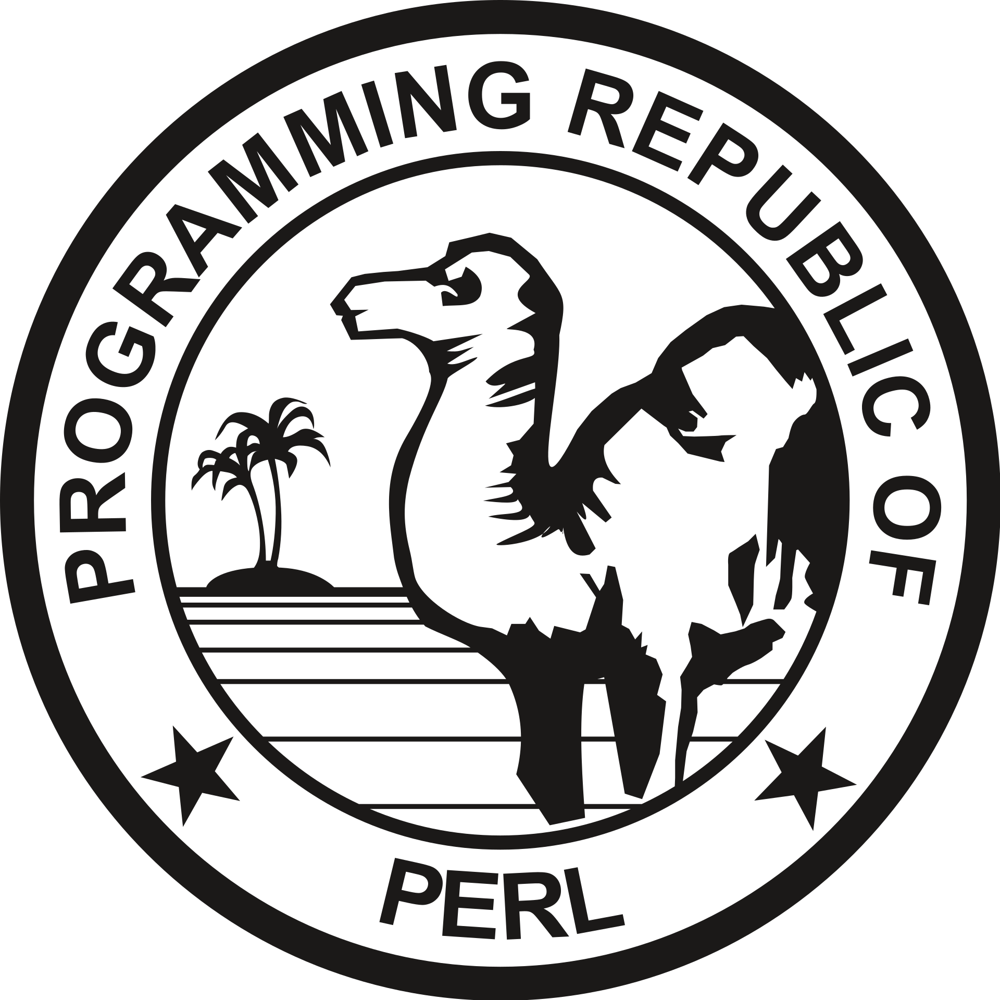

## No grand narrative

I set out to deconstruct all the computer languages and recombine them.
I lovingly reused features from many languages.

## Why this works

- Worse is better
- Postmodernists prefer AND, modernists OR
- Possible to write messy & clean programs

-----------------------------------------------------------------------------------------
- template: lists

# Worse is better

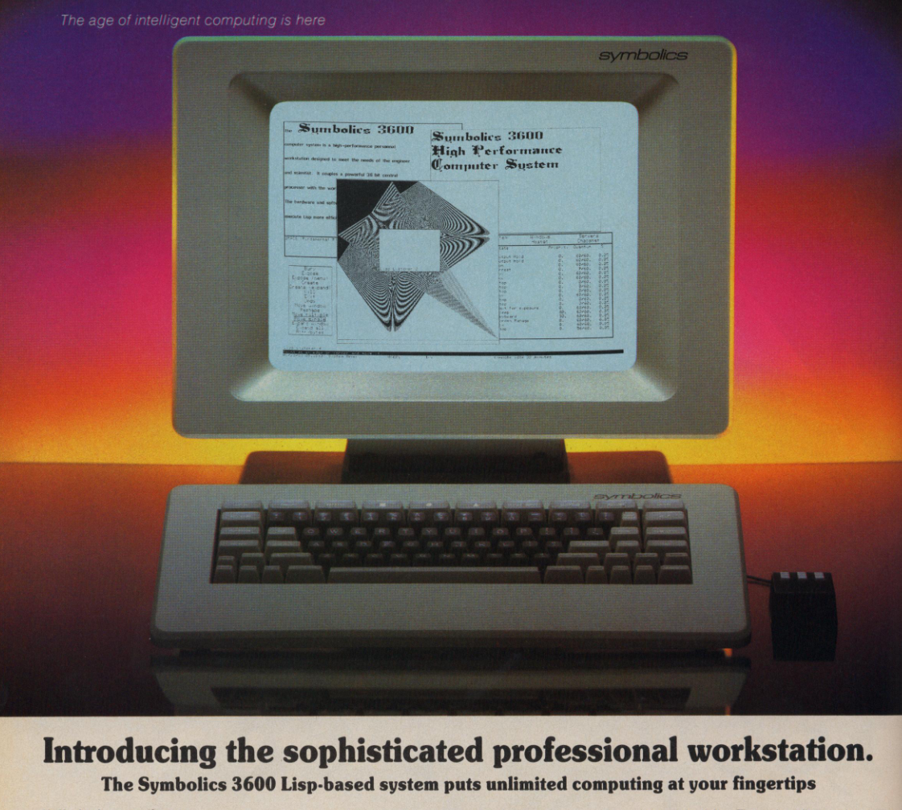

## The right thing

- Common LISP, ITS system
- No incorrectness / inconsistency
- Completeness, then simplicity

## Worse is better

- UNIX and C language
- Simple is better than correct, consistent & complete

*****************************************************************************************
- template: subtitle

# Concepts and methods
## Unexplored inspirations

-----------------------------------------------------------------------------------------
- template: image
- class: smaller

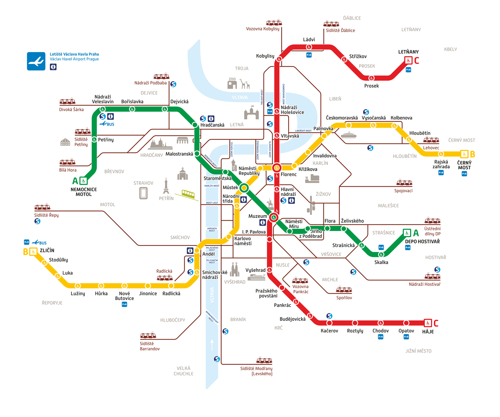

# Image of a city

**How do we navigate around cities?**

**And codebases?**

-----

Districts, landmarks  
and pathways

Good design supports navigability and legibility

-----------------------------------------------------------------------------------------
- template: image
- class: smaller

# Materials

**Building materials  
that look bad before  
they go bad**

------

Software tends to  
break abruptly without  
any warning...

Is there an alternative?

-----------------------------------------------------------------------------------------
- template: image

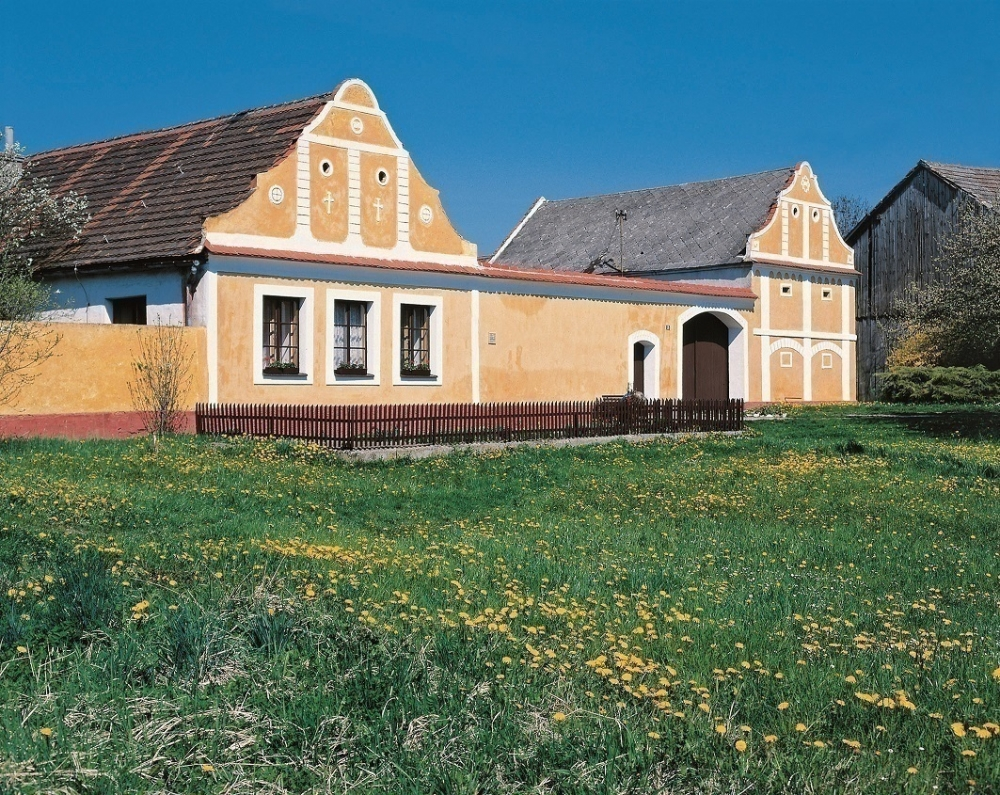

# Vernacular architecture

**Achieves a good fit without the continuous reinvention of forms**

------

Can we build software without reinventing forms? Spreadsheets? Configuration?

*****************************************************************************************
- template: subtitle

# Conclusions
## Learning from architecture

-----------------------------------------------------------------------------------------
- template: image
- class: smaller

# Architecture and design in context  

**Conceptual design rather than empirical science**

Powerful methodologies  
for idea generation

Appropriateness is harder to evaluate - wait and see!

-----------------------------------------------------------------------------------------
- template: lists
- class: smaller smallerspacing

# Reading

## No information hiding?

- Varv: Reprogrammable Interactive Sofware as a Declarative Data Structure
- Available at: http://vis.csail.mit.edu/pubs/varv.pdf

## What to read and how

- Declarative, extensible programming!
- Get a sense of how it works (Section 2)
- Look at evaluation (Section 5)

-----------------------------------------------------------------------------------------
- template: title

# Conclusions

**Learning from architecture and design**

- Methods & concepts for complex systems
- Architecture, urban planning and design
- Design patterns & pattern languages

---

**Tomáš Petříček**, 309 (3rd floor)  
_<i class="fa fa-envelope"></i>_ [petricek@d3s.mff.cuni.cz](mailto:petricek@d3s.mff.cuni.cz)  
_<i class="fa-solid fa-circle-right"></i>_ [https://tomasp.net](https://tomasp.net) | [@tomaspetricek](http://twitter.com/tomaspetricek)  
_<i class="fa-solid fa-circle-right"></i>_ https://d3s.mff.cuni.cz/teaching/nprg075

-----------------------------------------------------------------------------------------
- template: content
- class: condensed

# References (1/3)

**Recommended**

- Parnas, D. L. (1985). [Software aspects of strategic defense systems](https://dl.acm.org/doi/10.1145/214956.214961). Communications of the ACM, 28(12), 1326-1335.
- Singer, J. (2020). [Notes on notebooks: Is Jupyter the bringer of jollity?](http://www.dcs.gla.ac.uk/~jsinger/notebooks.pdf) In Onward!
- Taeumel, M. et al. (2022). [A Pattern Language of an Exploratory Programming Workspace](http://www.hpi.uni-potsdam.de/hirschfeld/publications/media/TaeumelLinckeReinHirschfeld_2022_APatternLanguageOfAnExploratoryProgrammingWorkspace_AuthorsVersion.pdf). Design Thinking Research
- Gabriel, R. (1991). [Lisp: Good News, Bad News, How to Win Big](https://www.dreamsongs.com/WIB.html)

**Just for fun...**

- Symbolics inc. (1983). [Introducing the sophisticated professional workstation](https://ieeexplore.ieee.org/stamp/stamp.jsp?tp=&arnumber=4037519). IEEE

-----------------------------------------------------------------------------------------
- template: content
- class: condensed

**Design patterns**

- Meszaros, G., & Doble, J. (1998). [A pattern language for pattern writing](http://xunitpatterns.com/~gerard/plopd3-pattern-writing-patterns-paper.pdf). Pattern languages of program design, 3
- Iba, T., & Isaku, T. (2016). [A pattern language for creating pattern languages: 364 patterns for pattern mining, writing, and symbolizing](https://dl.acm.org/doi/abs/10.5555/3158161.3158175). PLoP 2016
- Sasabe, A. et al. (2016). [Pattern mining patterns: a search for the seeds of patterns](https://hillside.net/plop/2016/papers/proceedings/papers/sasabe.pdf). Conference on Pattern Languages of Programs

**Software classics**

- Brooks Jr, F. P. (1975). [The mythical man-month](https://www.oreilly.com/library/view/mythical-man-month-the/0201835959/). Addison-Wesley
- Raymond, E. S. (1999). [The cathedral and the bazaar](http://www.catb.org/~esr/writings/cathedral-bazaar/). O'Reilly
- Gamma, E. et al. (1994). [Design Patterns: Elements of Reusable Object-Oriented Software](https://www.oreilly.com/library/view/design-patterns-elements/0201633612/). Addison-Wesley.

-----------------------------------------------------------------------------------------
- template: content
- class: condensed

**Architecture books**

- Jacobs, J. (1961). [The Death and Life of Great American Cities](http://www.randomhousebooks.com/books/86058/). Random House.
- Alexander, C. (1964). [Notes on the Synthesis of Form](https://www.hup.harvard.edu/catalog.php?isbn=9780674627512). Harvard.
- Alexander, C. et al. (1977). [A Pattern Language](https://global.oup.com/academic/product/a-pattern-language-9780195019193?cc=cz&lang=en&). Oxford.
- Alexander, C. (1979). [The Timeless Way of Building](https://global.oup.com/academic/product/the-timeless-way-of-building-9780195024029?lang=en&cc=cz). Oxford.
- Lynch, K. (1964). [The image of the city](http://mitpress.mit.edu/9780262620017/). MIT press.

**Programming design**

- Wall, L. (1999). [Perl, the first postmodern computer language](https://www.perl.com/pub/1999/03/pm.html/). Online
- Noble, J., & Biddle, R. (2004). [Notes on notes on postmodern programming](https://homepages.ecs.vuw.ac.nz/~kjx/papers/nopp.pdf). ACM SIGPLAN Notices, 39(12)
- Petricek, T. (2022). [The Timeless Way of Programming](http://tomasp.net/blog/2022/timeless-way/). Online.
- Clark, C., & Basman, A. (2017). [Tracing a paradigm for externalization: Avatars and the GPII Nexus](https://refuses.github.io/preprints/avatars.pdf). Salon des Refusés
