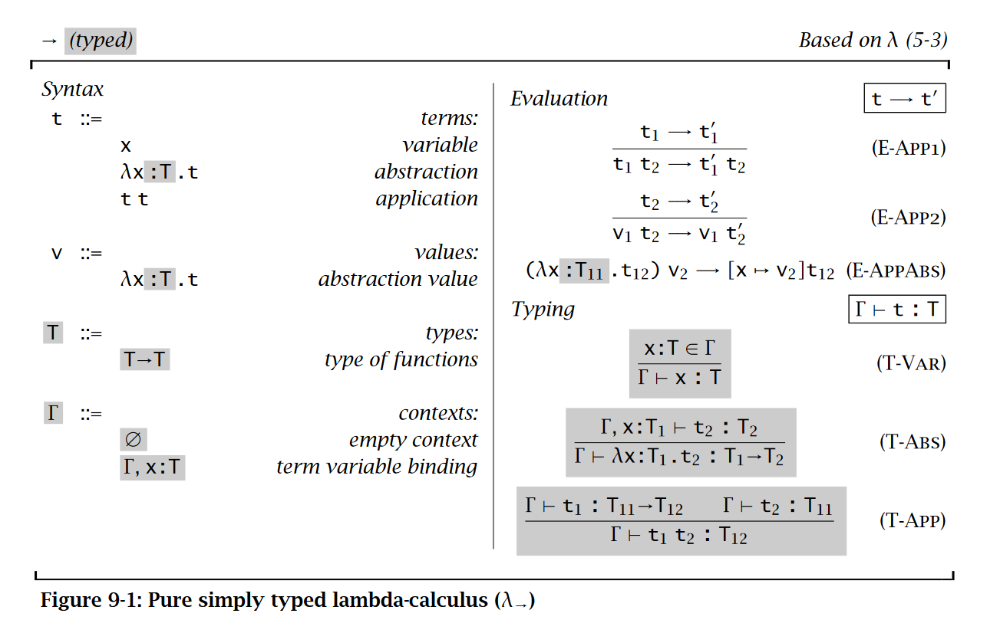
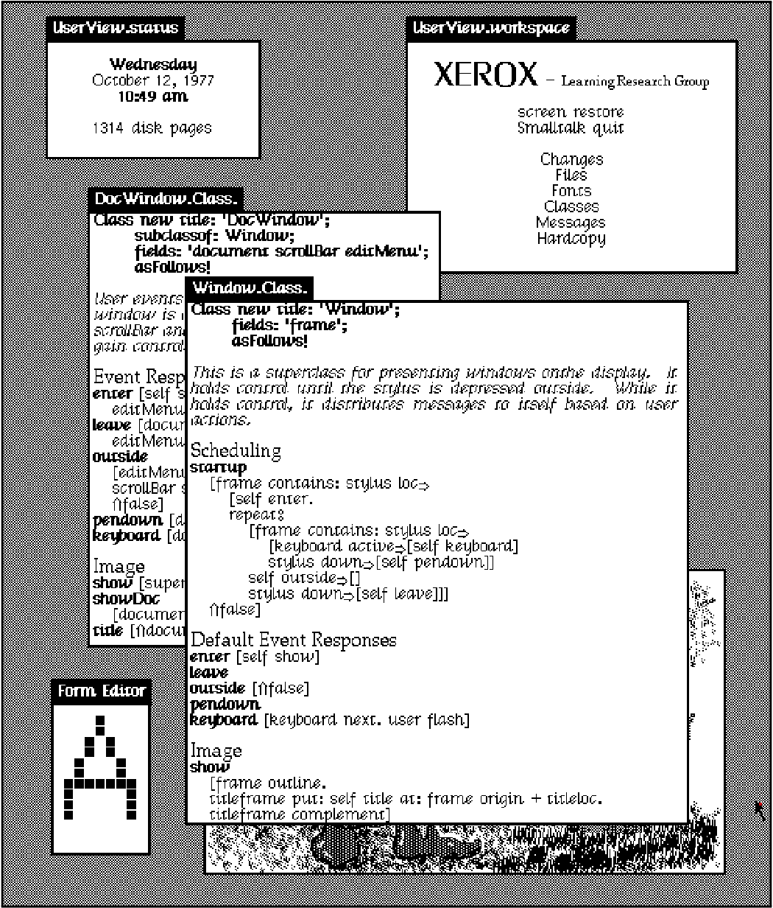

*****************************************************************************************
- template: title

# NPRG075
## Programming language design

**Tomáš Petříček**, 309 (3rd floor)  
_<i class="fa fa-envelope"></i>_ [petricek@d3s.mff.cuni.cz](mailto:petricek@d3s.mff.cuni.cz)  
_<i class="fa-solid fa-circle-right"></i>_ [https://tomasp.net](https://tomasp.net) | [@tomaspetricek](http://twitter.com/tomaspetricek)

**Lectures:** Monday 12:20, S7  
_<i class="fa-solid fa-circle-right"></i>_ https://d3s.mff.cuni.cz/teaching/nprg075

*****************************************************************************************
- template: subtitle

# Introduction
## What? Why? How?

-----------------------------------------------------------------------------------------
- template: largeicons

# My background

- *fa-landmark* **PhD, University of Cambridge**  
  Context-aware programming languages

- *fa-industry* **Microsoft Research Cambridge**  
  F# and applied functional programming

- *fa-city* **The Alan Turing Institute, London**  
  Expert and non-expert tools for data science

- *fa-church* **University of Kent, Canterbury**  
  History and programming systems

-----------------------------------------------------------------------------------------
- template: image

# Programming language theory

**Prove properties about small formal models**

"Well-typed programs do not go wrong"

**Avoid subtle mistakes!**

-----------------------------------------------------------------------------------------
- template: image

# Data science tools and languages

**Result is a document not a program**

**Working with one concrete dataset**

Different language and system requirements!

-----------------------------------------------------------------------------------------
- template: image

# Programming systems & history

**Interacting with a stateful environment**

Let programmers do more in new ways...

**It's not just a language!**

-----------------------------------------------------------------------------------------
- template: lists

# Bring everything together

## Systems, not languages

- yo
- yo
- yo

## Interdisciplinary research

- yo
- yo
- yo

*****************************************************************************************
- template: icons

# Motivation 1
## Tools for open data-driven journalism

- *fa-chalkboard-teacher*  Most work done in external libraries!
- *fa-search* Transparency through openness
- *fa-database* Uniformity across data sources xx
- *fa-search* Yet another option

*****************************************************************************************
- template: notes

Practical
- About me
- Idea
- Credit
- Plan

Conventionally
- Functional, OOP, Logic, etc.
- Features like lambdas, scoping, pointers
- Parsing and automata
- Compilers and interpreters

Design
- Definition
- Design vs science vs art
- Making things - bigger picture

Research methods
- Requirements, Creation, Evaluation
- Formal
- Empirical
- Conceptual
- History
- Cognitive

Type Script
- https://github.com/Microsoft/TypeScript/issues/9825#issuecomment-234115900

Cultures of programming
- Hackers
- Engineers
- Mathematicians
- Humanists
- Managers

Interdisciplinarity
- Combine everything - that is hard but only way!

*****************************************************************************************
- template: icons

# Motivation 4
## Tools for open data-driven journalism

- *fa-chalkboard-teacher* Simplicity and learnability
- *fa-search* Transparency through openness
- *fa-database* Uniformity across data sources xx

*****************************************************************************************
