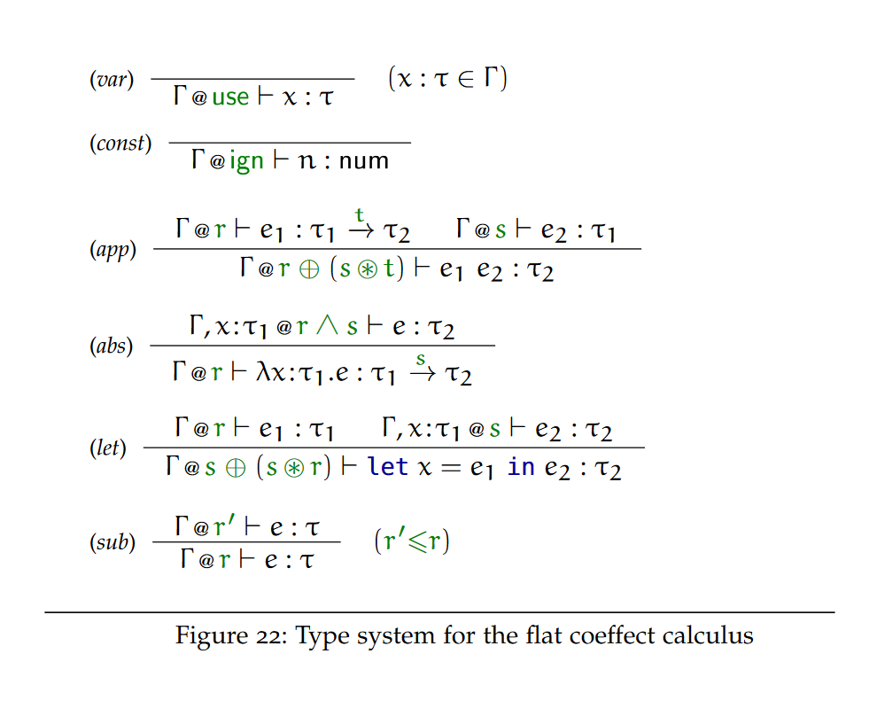
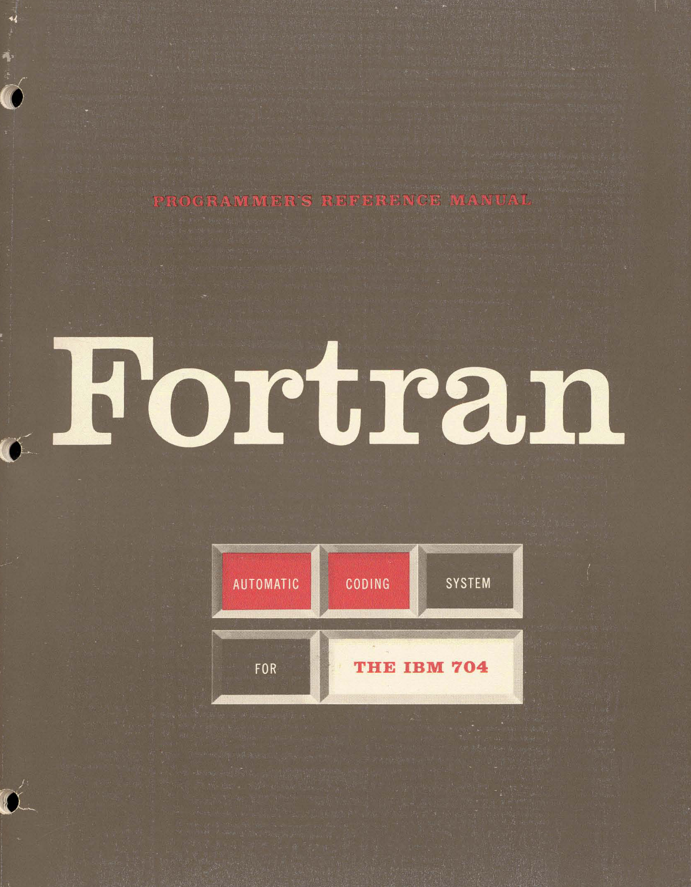
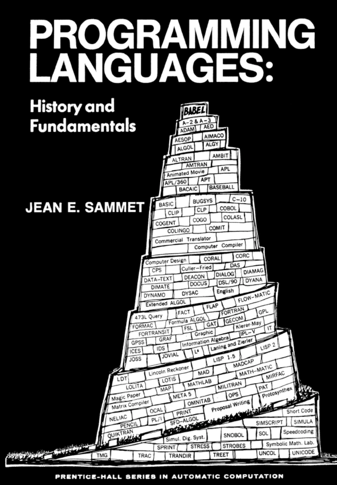
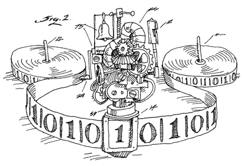
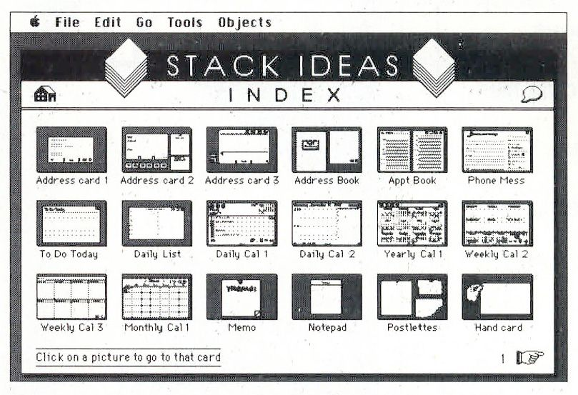
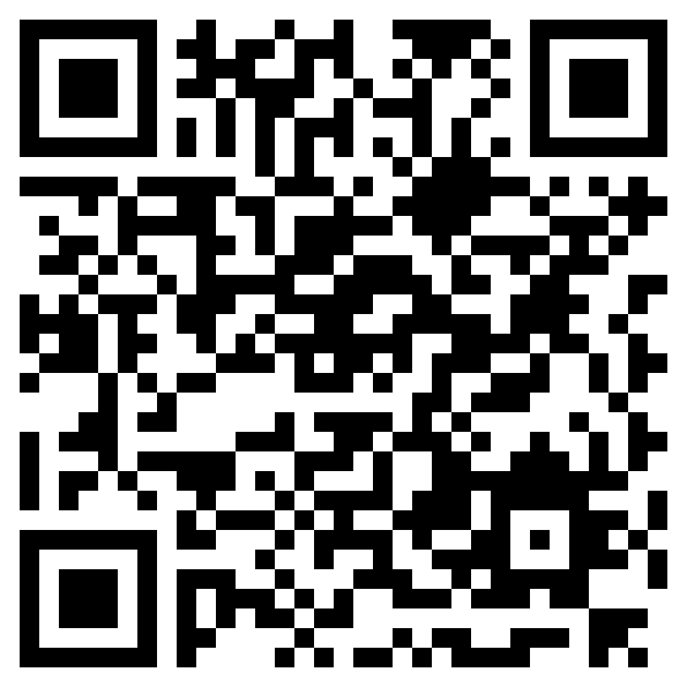
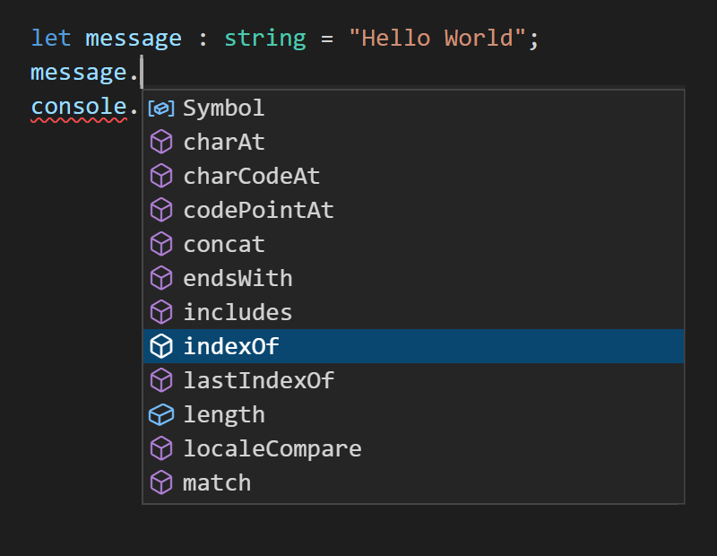

*****************************************************************************************
- template: title

# NPRG075
## Programming language design

---

**Tomáš Petříček**, 309 (3rd floor)  
_<i class="fa fa-envelope"></i>_ [petricek@d3s.mff.cuni.cz](mailto:petricek@d3s.mff.cuni.cz)  
_<i class="fa-solid fa-circle-right"></i>_ [https://tomasp.net](https://tomasp.net) | [@tomaspetricek](http://twitter.com/tomaspetricek)

**Lectures:** Monday 12:20, S7  
_<i class="fa-solid fa-circle-right"></i>_ https://d3s.mff.cuni.cz/teaching/nprg075


*****************************************************************************************
- template: subtitle

# Introduction
## What? Why? How?

-----------------------------------------------------------------------------------------
- template: largeicons

# My background

- *fa-landmark* **PhD, University of Cambridge**  
  Context-aware programming languages

- *fa-industry* **Microsoft Research Cambridge**  
  F# and applied functional programming

- *fa-city* **The Alan Turing Institute, London**  
  Expert and non-expert tools for data science

- *fa-church* **University of Kent, Canterbury**  
  History and programming systems

-----------------------------------------------------------------------------------------
- template: image
- class: smaller  



# Types for context-aware programming

**Program as expression in small formal language**

Type system determines what programs are valid

Safety proof shows no unauthorized accesses

-----------------------------------------------------------------------------------------
- template: image


# Data science tools and languages

**Result is a document not a program**

**Working with one concrete dataset**

Different language and system requirements!

-----------------------------------------------------------------------------------------
- template: image


# Programming systems & history

**Interacting with a stateful environment**

Let programmers do more in new ways...

**It's not just a language!**

-----------------------------------------------------------------------------------------
- template: lists

# Bringing everything together


## Systems ⊃ languages

- Programming process matters
- Tools shape languages
- Harder to formalize & study!

## Interdisciplinary research

- Formal language models
- Systematic design
- Qualitative and quantitative studies

-----------------------------------------------------------------------------------------
- template: content

# Case study: LINQ

LINQ queries in Visual Basic .NET and C#

```
Dim db As New northwindDataContext
Dim ukCompanies =
  From cust In db.Customers
  Where cust.Country = "UK"
  Select cust.CompanyName, cust.City
```

----------

Why confuse programmers familiar with SQL?

```sql
SELECT [CompanyName], [City]
WHERE [Country] = 'UK'
FROM dbo.[Northwind]
```

-----------------------------------------------------------------------------------------
- template: content

# What to expect?
## Content and materials

**Many different programming systems**  
TypeScript, Jupyter, ML/F#, Smalltalk, BASIC

**Many different research methods**  
Design, logic, proofs, user studies

**This is a new work-in-progress course**  
Slides on the web, but no textbook

-----------------------------------------------------------------------------------------
- template: image



# Credit / zápočet

**Small independent  
or group project**

Using any of the covered method

Described in a brief report (5 pages)

**Deadlines**  
**Topic by January 8**  
**Draft by February 28**  

*****************************************************************************************
- template: subtitle

# Programming languages
## Conventional topics

-----------------------------------------------------------------------------------------
- template: lists

# Paradigms and features



## Language paradigms

- Functional, OOP, Logic, etc.
- Their fundamental concepts
- Interesting "extreme" designs

## Language features

- Variable scoping, pointers
- Lambda abstraction, inheritance
- Design and implementation

-----------------------------------------------------------------------------------------
- template: lists

# Theory and implementation



## Parsing and automata

- Theory of formal grammars
- Parser implementation
- Computability theory

## Compilers and interpreters

- Implementation techniques
- Register allocation
- Meta-circular interpreters

-----------------------------------------------------------------------------------------
- template: image


# Why is this <br />not enough?

**Talks about "what"  
but not about "how"**

Treat design as a research problem!

What can we study about programming systems?

*****************************************************************************************
- template: subtitle

# Design
## As a research discipline

-----------------------------------------------------------------------------------------
- template: image
- class: smaller


# What is design?

Design is the intentional **solution of a problem**, by the creation of plans for a **new sort of thing**, where the plans would not be immediately seen, by a reasonable person, as an inadequate solution.

Parsons (2015)

-----------------------------------------------------------------------------------------
- template: lists
- class: smaller

# Designerly ways


## Sciences study natural world

- By experiment, aiming at truth

## Humanities study experience

- By analogy, aiming at justice

## Design studies the artificial

- By synthesis, aiming at appropriateness

*****************************************************************************************
- template: subtitle

# Research methods
## Interdisciplinary research

-----------------------------------------------------------------------------------------
- template: image
- class: smaller


# Interdisciplinary programming language research

**Creating designs**  
Interviews, prototyping, formalism, analysis, history

**Evaluating designs**  
Qualitative and quantitative studies, formal proofs

(Coblenz et al., 2018)

-----------------------------------------------------------------------------------------
- template: image


# Programming language theory

**Prove properties about small formal models**

"Well-typed programs do not go wrong"

**Discover and avoid subtle mistakes!**

-----------------------------------------------------------------------------------------
- template: image
- class: noborder


# Human-centric system design

**User studies, questionnaires, interviews, etc.**

Qualitative analysis to design & test ideas

Quantitative analysis to compare designs

-----------------------------------------------------------------------------------------
- template: image



# History of programming

**What interesting past ideas were lost?**

And the socio-political reasons for that?

**Use history as source for new design ideas!**

-----------------------------------------------------------------------------------------
- template: content

*****************************************************************************************
- template: subtitle

# Cultures of programming
## Common ways of thinking

-----------------------------------------------------------------------------------------
- template: lists
- class: smaller

# Case study: TypeScript



## Unsoundness by design

- Type checking limitations!
- It's a feature, not a bug?
- [tinyurl.com/nprg075-ts](https://github.com/Microsoft/TypeScript/issues/9825#issuecomment-234115900)

## Design questions

- What research methods to use?
- Is partial soundness a thing?
- Is there a better design?
- What does "better" mean?

-----------------------------------------------------------------------------------------
- template: lists
- class: smaller

# Cultures of programming



## Engineering culture

- Programs are complex systems
- Tools can help us cope
- Careful balance of trade-offs

## Mathematical culture

- Programs as formal entities
- Like good mathematics...
- Safe, composable, elegant

-----------------------------------------------------------------------------------------
- template: lists
- class: smaller

# Cultures of programming


## Humanistic culture

- Augmenting human intellect
- Programming helps us think
- Language close to human concepts

## Hacker culture

- Programs are fundamentally bits
- Do not restrict the programmer
- Convenience, but full access

-----------------------------------------------------------------------------------------
- template: icons

# Type safety
## Different perspectives

- *fa-person-chalkboard* Safety is the very essence of types!
- *fa-people-carry-box* Useful as long as it makes programming easier
- *fa-person-falling-burst* Sometimes, you need to break the rules
- *fa-person-dots-from-line* Does it help programmers think better?

*****************************************************************************************
- template: subtitle

# Conclusions
## What to expect

-----------------------------------------------------------------------------------------
- template: content

# Course outline
## Preliminary structure

**Design** - Design and pattern languages  
**Usability** - Human-centric language design  
**Semantics** - Formal models of programming     
**Types** - Types and type safety proofs    
**Beyond** - Unexpected perspectives on types    
**Paradigms** - History and programming systems    
**Complementary** - Learning from past systems    
**Cognition** - How humans think about programming  

-----------------------------------------------------------------------------------------
- template: title

# Conclusions

**How to do research about<br /> programming language design?**

- Inherently interdisciplinary topic
- Logic, design, user studies, history & more!

---

**Tomáš Petříček**, 309 (3rd floor)  
_<i class="fa fa-envelope"></i>_ [petricek@d3s.mff.cuni.cz](mailto:petricek@d3s.mff.cuni.cz)  
_<i class="fa-solid fa-circle-right"></i>_ [https://tomasp.net](https://tomasp.net) | [@tomaspetricek](http://twitter.com/tomaspetricek)  
_<i class="fa-solid fa-circle-right"></i>_ https://d3s.mff.cuni.cz/teaching/nprg075

-----------------------------------------------------------------------------------------
- template: content
- class: condensed

# References

**Methodology**

- Coblenz, M., et al. (2018). [Interdisciplinary<br /> programming language design](https://dl.acm.org/doi/pdf/10.1145/3276954.3276965). ACM Onward!
- Parsons, G. (2015). [The philosophy of design](https://www.wiley.com/en-us/The+Philosophy+of+Design-p-9780745663890). John Wiley & Sons
- Cross, N. (2007). [Designerly ways of knowing](https://www.bird-international-research-in-design.org/books). BIRD

**Assorted examples**

- Marasoiu, M. et al. (2019). [Cuscus: An end user<br />programming tool for data visualisation](https://link.springer.com/chapter/10.1007/978-3-030-24781-2_8). Springer
- Pierce, B. C. (2002). [Types and programming languages](https://www.cis.upenn.edu/~bcpierce/tapl/). MIT Press
- Petricek, T., Jakubovic, J. (2021). [Complementary science of interactive programming systems](http://tomasp.net/academic/drafts/complementary). HaPoC
- Petricek, T. (2017). [Context-aware programming<br /> languages](https://tomasp.net/coeffects/). University of Cambridge
