- title: Formal models of programming | Programming language design (NPRG075)

*****************************************************************************************
- template: title

# NPRG075
## Formal models of programming

---

**Tomáš Petříček**, 309 (3rd floor)  
_<i class="fa fa-envelope"></i>_ [petricek@d3s.mff.cuni.cz](mailto:petricek@d3s.mff.cuni.cz)  
_<i class="fa-solid fa-circle-right"></i>_ [https://tomasp.net](https://tomasp.net) | [@tomaspetricek](http://twitter.com/tomaspetricek)

**Lectures:** Monday 12:20, S7  
_<i class="fa-solid fa-circle-right"></i>_ https://d3s.mff.cuni.cz/teaching/nprg075


*****************************************************************************************
- template: subtitle

# History
## Programming as mathematics

-----------------------------------------------------------------------------------------
- template: image


# Programming in the late 1940s

**ENIAC programmed by plugging wires and flipping switches**

"The ENIAC was a son-of-a-bitch to program" - Jean (Jennings) Bartik

-----------------------------------------------------------------------------------------
- template: lists
- class: mathscicomp smaller border

# Mathematical science of computation


## John McCarthy (1962)

In a mathematical science, it is possible to deduce from the
basic assumptions, the important properties of the entities treated by the
science.

## What we want to answer

- Does transformation preserve meaning?
- Does translation procedure correctly translate?
- Do two programs compute the same function?


<style> .mathscicomp h1 { letter-spacing:-2px; } </style>

-----------------------------------------------------------------------------------------
- template: image

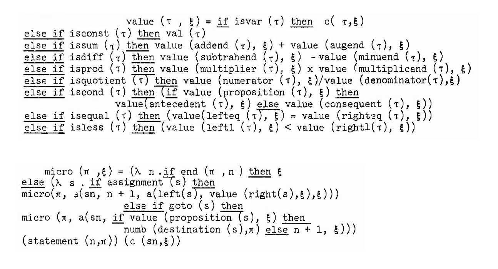

# Microalgol (1964)

**Syntax and semantics of trivial Algol subset**

$micro(\pi,\xi)$ gives the final state of a program $\pi$ run in a state $\xi$

"Description of the state of an Algol computation
will clarify (..) compiler design"

-----------------------------------------------------------------------------------------
- template: icons

# Formal models
## What are they good for?

- *fa-wave-square* Make sense of tricky language features
- *fa-code* Prove properties of specific programs
- *fa-arrow-down-a-z* Prove properties of the language
- *fa-bugs* Make sure type system actually prevents bugs!

-----------------------------------------------------------------------------------------
- template: image
- class: smaller


# The definition of Standard ML (1990s)

**Operational semantics  
and type system for a complete language**

Even language this simple had murky parts!

-----------------------------------------------------------------------------------------
- template: code

```fsharp

// Function: 'a -> 'a list
let callLogger =
  // List: 'a list
  let mutable log = []
  fun x ->
    log <- x :: log
    log

// Can we call this with:
callLogger 10
callLogger "hi"
```

# Generalization and value restriction

ML makes top-level definitions polymorphic

-----

**Allowing that for values is unsound!**

-----------------------------------------------------------------------------------------
- template: lists
- class: smaller

# Soundness


## Surely, we know better?

- Are such problems in programming languages used today?
- [tinyurl.com/nprg075-unsound](https://io.livecode.ch/learn/namin/unsound)

## Unexpected interactions!

- Many Java extensions formalized
- Formalizations with soundness proofs!
- This is interaction between multiple features...

*****************************************************************************************
- template: subtitle

# Semantics
## Formal language definitions

-----------------------------------------------------------------------------------------
- template: largeicons

# Language semantics types

- *fa-list-check* **Axiomatic semantics**  
  Define rules satisfied by individual commands

- *fa-shapes* **Denotational semantics**  
  Assign mathematical entity to each program

- *fa-arrow-down* **Big-step operational semantics**  
  Describe how terms reduce to values

- *fa-arrow-right* **Small-step operational semantics**  
  Evaluation as gradual rewriting of terms

-----------------------------------------------------------------------------------------
- template: content

# Language semantics types

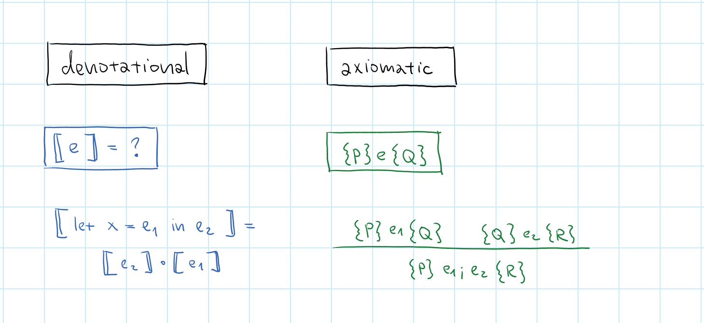

-----------------------------------------------------------------------------------------
- template: content

# Language semantics types

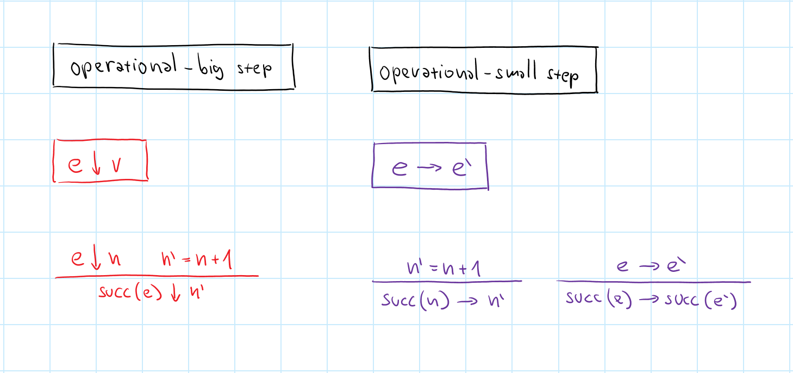

-----------------------------------------------------------------------------------------
- template: image
- class: smaller


# Why small-step?

**Easier to write than axiomatic or denotational**

But harder to use for program equivalence

**Good textbook and popular in PL research community**

Works for programs that do not terminate

*****************************************************************************************
- template: subtitle

# Semantics
## Definition of an ML subset

-----------------------------------------------------------------------------------------
- template: subtitle

# Demo
## Functions and numbers in F#

-----------------------------------------------------------------------------------------
- template: content

# Expressions and evaluation


-----------------------------------------------------------------------------------------
- template: content

# Evaluation rules

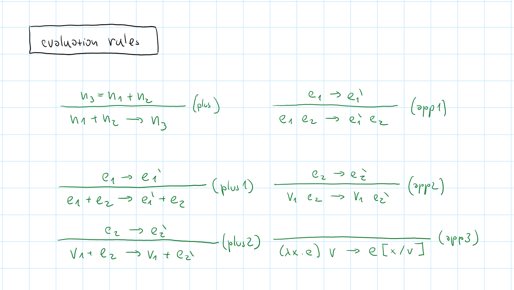

-----------------------------------------------------------------------------------------
- template: content

# Functions and numbers

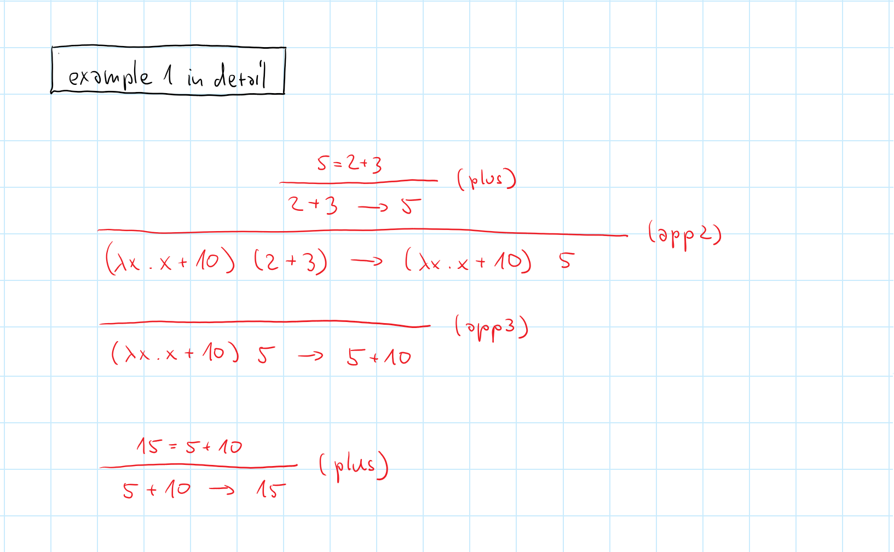

-----------------------------------------------------------------------------------------
- template: content

# Functions and currying

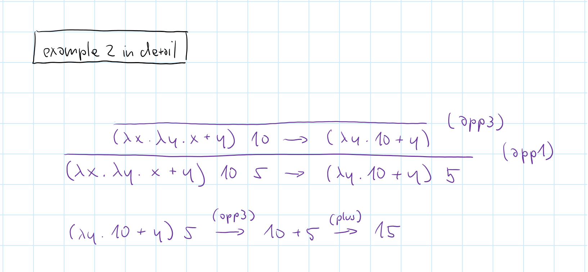

-----------------------------------------------------------------------------------------
- template: content

# Simplifying the rules

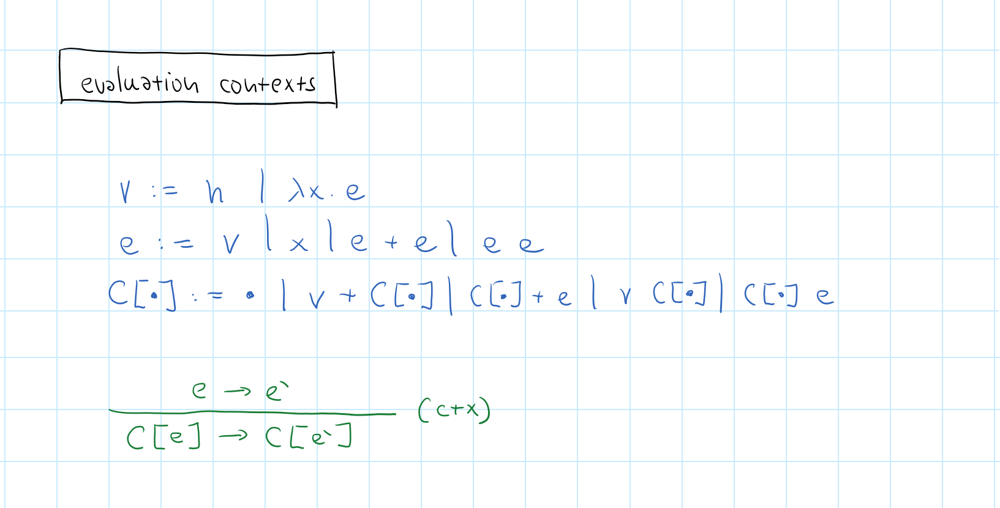

-----------------------------------------------------------------------------------------
- template: content

# Conditionals and stuck state

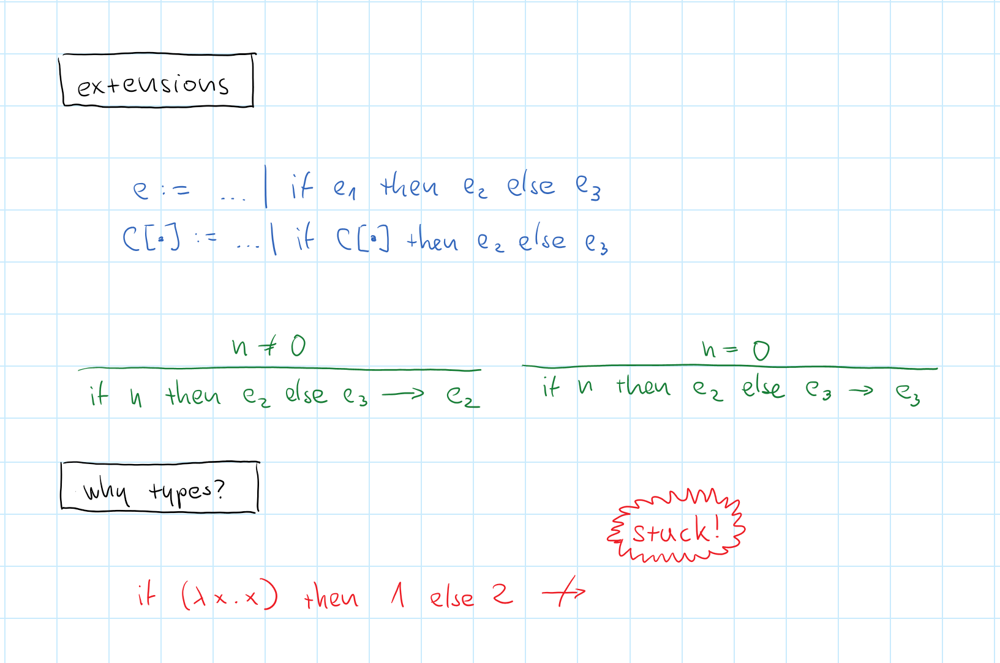

-----------------------------------------------------------------------------------------
- template: content

# Adding references

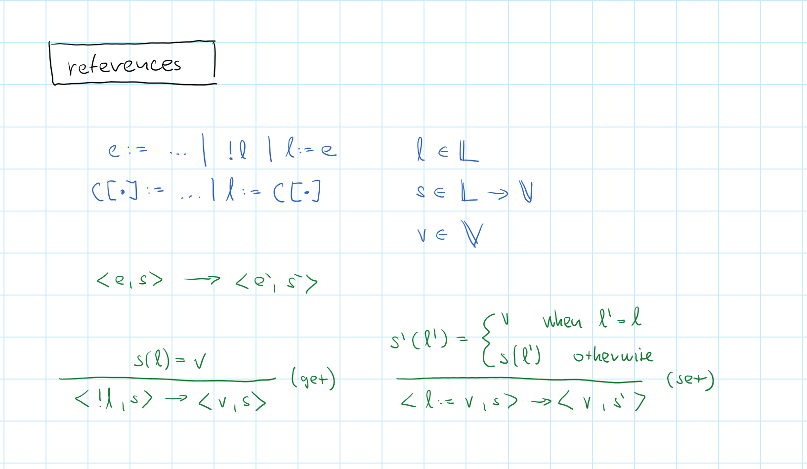

-----------------------------------------------------------------------------------------
- template: lists
- class: smaller

# What did we learn?


## Interesting aspects

- Evaluation order of sub-expressions
- Laziness of conditional expressions
- What needs to be in the state

## Interesting things left out

- Data structures: records, unions, lists
- Language features: recursion, exceptions
- Hard things: Concurrency, input and output

*****************************************************************************************
- template: subtitle

# ReactiveX
## Programming with observables

-----------------------------------------------------------------------------------------
- template: lists
- class: smaller2x

# Functional reactive programming


## Classic functional style

- Functional reactive animations (1990s)
- Composing *behaviours* and *events*
- Revised in the Elm programming style

## Observables and events

- Events that occur and produce values
- Mouse moves, server notifications, user inputs, ...
- Transformed using a range of *operators*

-----------------------------------------------------------------------------------------
- template: lists
- class: smaller2x

# Functional reactive programming


## Reactive animations (Elliott, 1997)

```haskell
followMouseAndDelay u =
 follow `over` later 1 follow
  where
   follow = move (mouseMotion u) jake
```

## How does it work

- `mouseMotion` represents current mouse position
- `later` delays time by X seconds
- `over` overlays multiple animations

-----------------------------------------------------------------------------------------
- template: image
- class: smaller


# Reactive eXtensions

Events represented by `Observable<T>`

Produces values when something happen

Operators turn one or more observables into a new one

-----------------------------------------------------------------------------------------
- template: subtitle

# Demo
## Programming with RxJS

*****************************************************************************************
- template: subtitle

# Semantics
## Formalizing observables

-----------------------------------------------------------------------------------------
- template: content

# Minimal language with events

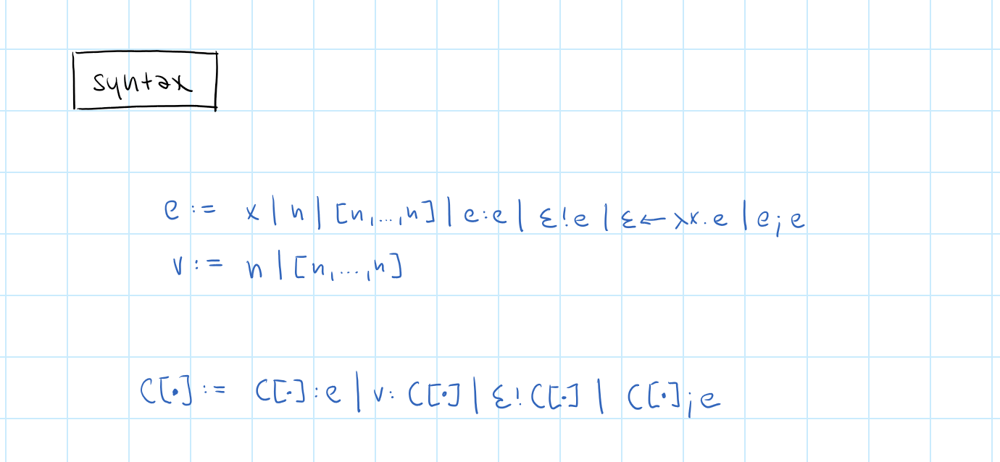

-----------------------------------------------------------------------------------------
- template: subtitle

# Demo
## Lists and sequencing in F#

-----------------------------------------------------------------------------------------
- template: content

# Modelling concurrency


-----------------------------------------------------------------------------------------
- template: content

# Triggering events

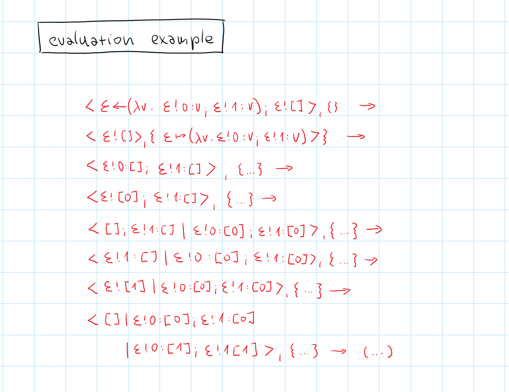

-----------------------------------------------------------------------------------------
- template: content

# Lists, sequencing and steps

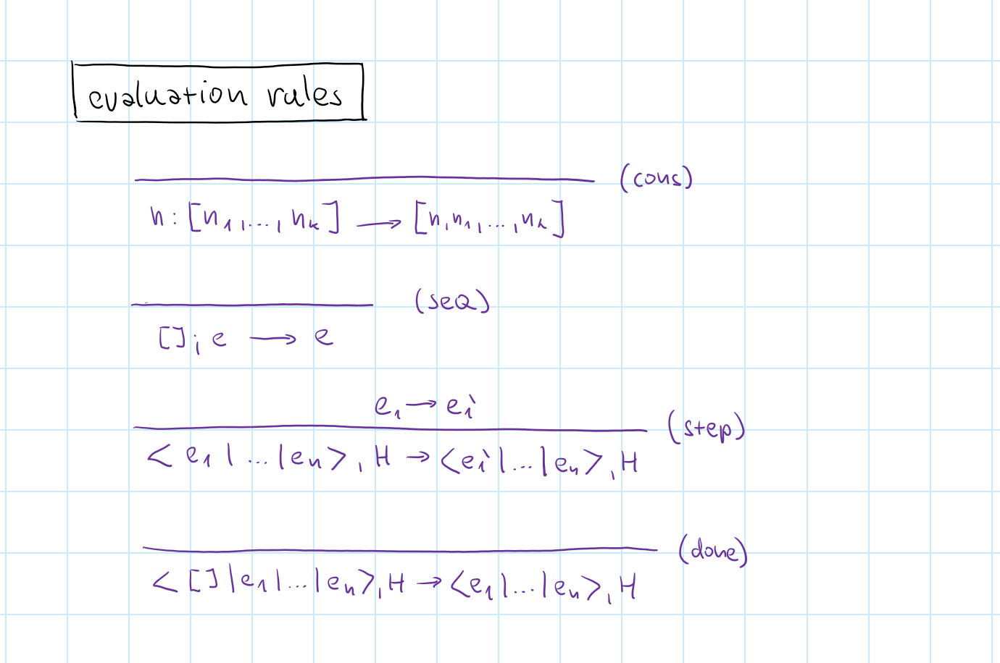

-----------------------------------------------------------------------------------------
- template: content

# Rules for event handlers

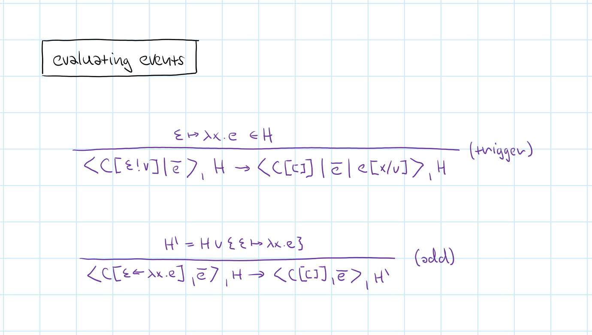

-----------------------------------------------------------------------------------------
- template: lists
- class: smaller border

# Events calculus

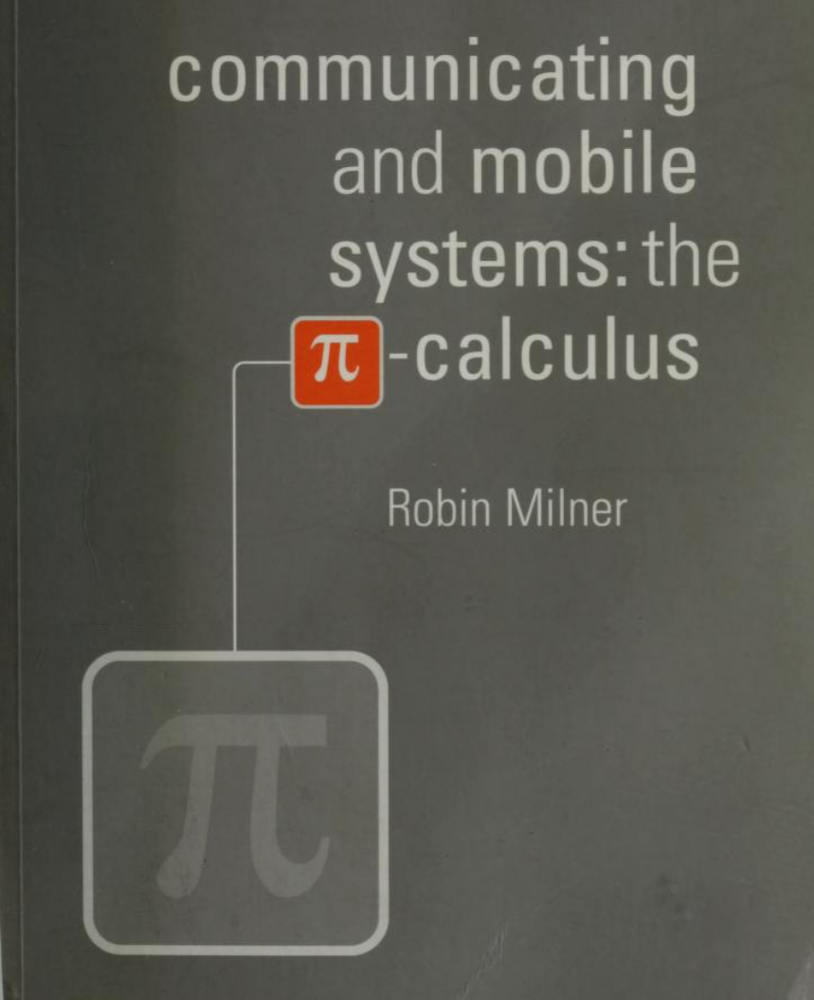

## Focus on what matters

- Lists, numbers and events only
- No functions or recursion!
- Probably still Turing-complete

## What did we learn

- Sequence of concurrent expressions
- Selection of expression to be run
- Scheduling when event is triggered

-----------------------------------------------------------------------------------------
- template: content

# Alternative rules

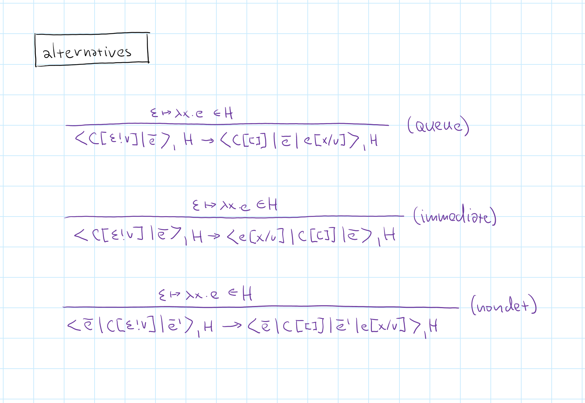


*****************************************************************************************
- template: subtitle

# Conclusions
## Formal models

-----------------------------------------------------------------------------------------
- template: image
- class: smaller


# Formal models

**Useful design guide and for making formal claims**

Explains core ideas of a system in a succinct way

The danger is producing languages that look  
well on paper!

-----------------------------------------------------------------------------------------
- template: largeicons

# Language semantics types

- *fa-not-equal* **Lambda calculus**  
  Logic (1930s) but used for PL semantics (1960s+)

- *fa-diagram-project* **Pi calculus, CCS and CSP**  
  Models of concurrent systems (1980s-90s)

- *fa-network-wired* **Join calculus**  
  Distributed asynchronous programming (1990s)

- *fa-lock-open* **Programming language theory**  
  Memory regions, effects and coeffects, locks, etc.

-----------------------------------------------------------------------------------------
- template: lists
- class: smaller

# Reading


## Null safety in Dart

- Avoiding `null` dereferencing with types
- Available at: https://dart.dev/null-safety/understanding-null-safety

## Why read this

- Simple useful type system feature!
- Good discussion on soundness
- More languages have this: Swift, Rust, C#, TypeScript

-----------------------------------------------------------------------------------------
- template: title

# Conclusions

**Formal models of programming**

- Programming language theory, Part I
- Evaluation over syntactic structures
- Better for small and stateless systems

---

**Tomáš Petříček**, 309 (3rd floor)  
_<i class="fa fa-envelope"></i>_ [petricek@d3s.mff.cuni.cz](mailto:petricek@d3s.mff.cuni.cz)  
_<i class="fa-solid fa-circle-right"></i>_ [https://tomasp.net](https://tomasp.net) | [@tomaspetricek](http://twitter.com/tomaspetricek)  
_<i class="fa-solid fa-circle-right"></i>_ https://d3s.mff.cuni.cz/teaching/nprg075

----------------------------------------------------------------------------------------
- template: content
- class: condensed

# References (1/2)

**Semantics**

- Krishnaswami, N. (2021). [Semantics of Programming Languages](https://www.cl.cam.ac.uk/teaching/2021/Semantics/notes.pdf)
- Pierce, B. (2002). [Types and Programming Languages ](https://mitpress.mit.edu/9780262162098/types-and-programming-languages/). MIT
- Pierce, B (ed.) (2004). [Advanced Topics in Types and Programming Languages ](https://www.cis.upenn.edu/~bcpierce/attapl/). MIT

**History**

- Chruch, A. (1941). [The Calculi Of Lambda Conversion](https://archive.org/details/AnnalsOfMathematicalStudies6ChurchAlonzoTheCalculiOfLambdaConversionPrincetonUniversityPress1941). Princeton
- McCarthy, J. (1964). [A Formal Description of a Subset of ALGOL](https://apps.dtic.mil/sti/pdfs/AD0785050.pdf)
- McCarthy, J. (1963). [Towards a Mathematical Science of Computation](http://jmc.stanford.edu/articles/towards/towards.pdf)
- Milner, R. et al. (1997). [The Definition of Standard ML](https://direct.mit.edu/books/book/2094/The-Definition-of-Standard-ML). MIT

----------------------------------------------------------------------------------------
- template: content
- class: condensed

# References (2/2)

**Reactive**

- Elliott, C. (1998). [Composing Reactive Animations ](http://conal.net/fran/tutorial.htm). MSR
- [RxJS Primer - Learn RxJS](https://www.learnrxjs.io/learn-rxjs/concepts/rxjs-primer). Online
- Wan, Z., Hudak, P. (2000). [Functional reactive programming from first principles](https://dl.acm.org/doi/pdf/10.1145/349299.349331), PLDI

**Calculi**

- Landing, P. J. (1966). [The Next 700 Programming Languages](https://www.cs.cmu.edu/~crary/819-f09/Landin66.pdf). ACM
- Milner, R. (1986). [A Calculus of Communicating Systems](http://www.lfcs.inf.ed.ac.uk/reports/86/ECS-LFCS-86-7/ECS-LFCS-86-7.pdf). LFCS
- Hoare, C.A.R. (1978). [Communicating Sequential Processes](https://www.cs.cmu.edu/~crary/819-f09/Hoare78.pdf). ACM
- Milner, R. (1999). [Communicating and mobile systems: The Pi calculus](https://archive.org/details/communicatingmob00robi). Cambridge
- Fournet, C., Gonthier, G. (1996). [The reflexive CHAM and the join-calculus](https://www.classes.cs.uchicago.edu/archive/2007/spring/32102-1/papers/p372-fournet.pdf). POPL
