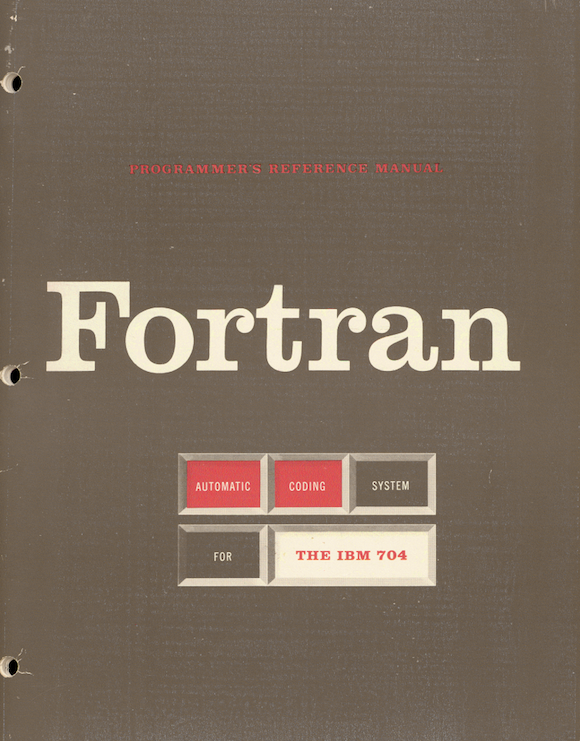
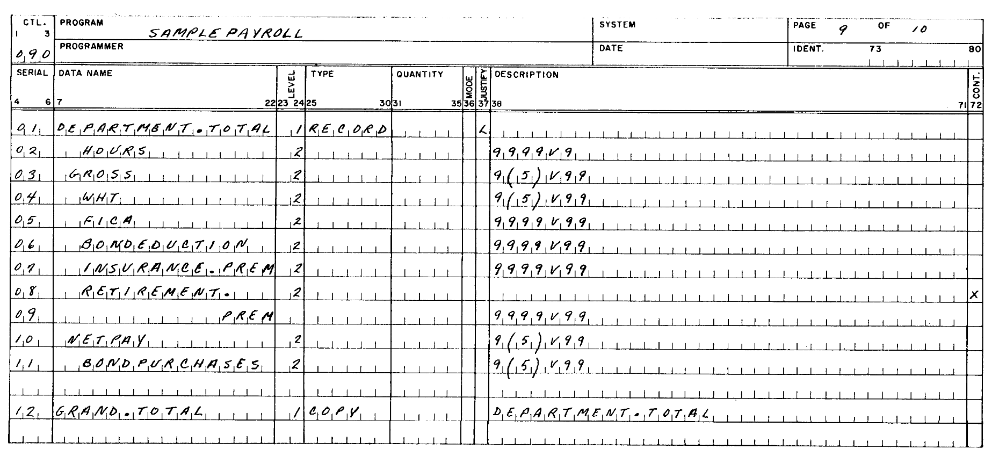
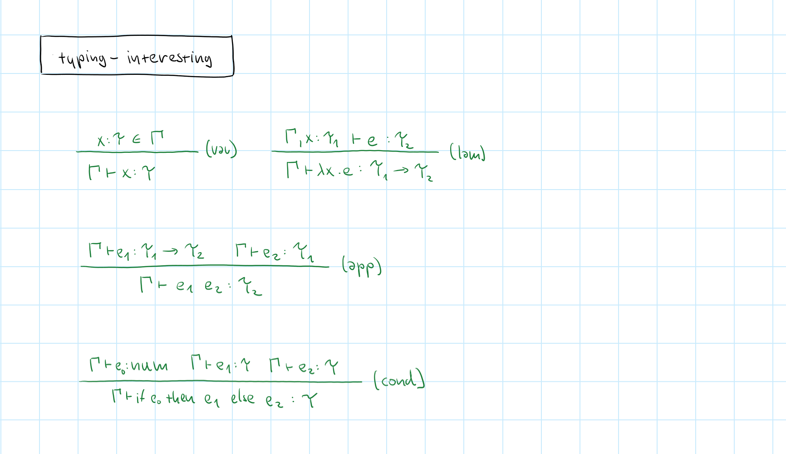
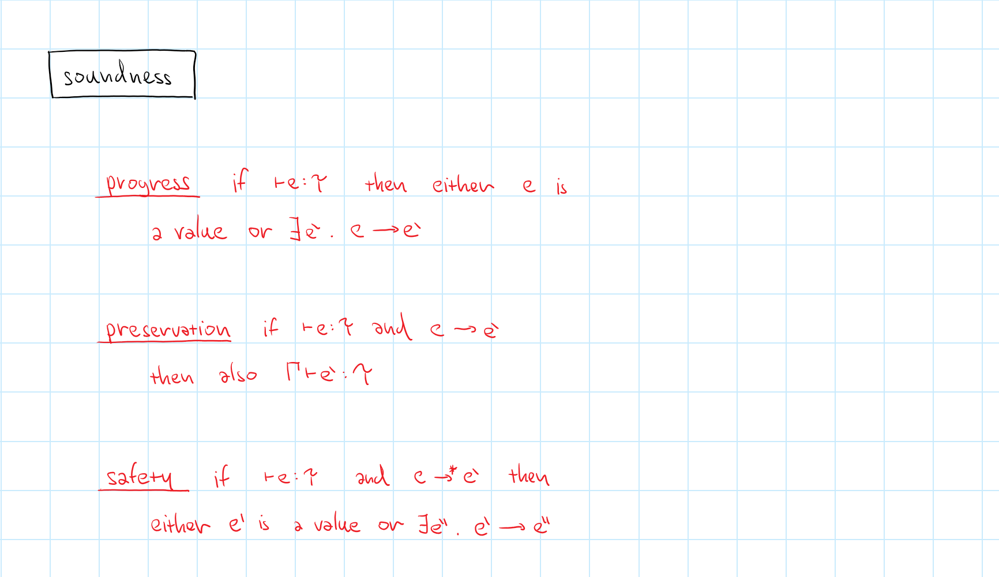
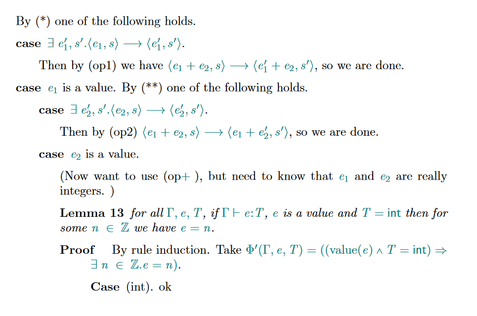
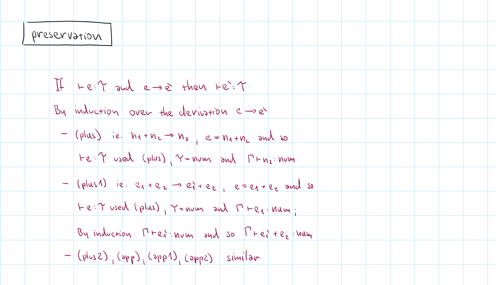
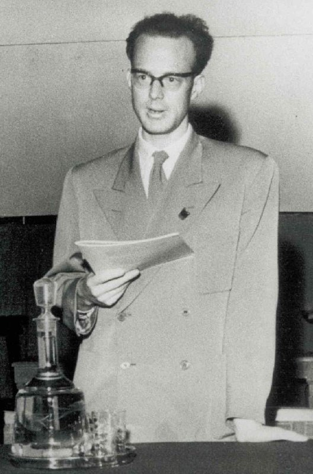
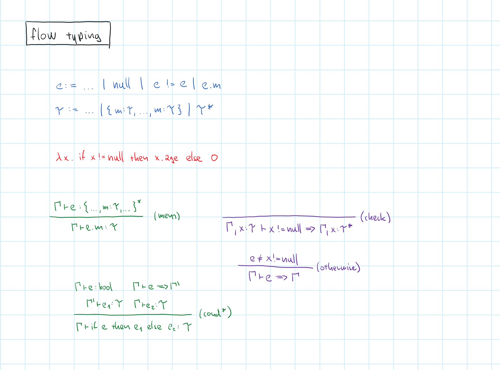

- title: Mathematics and engineering of types | Programming language design (NPRG075)

*****************************************************************************************
- template: title

# NPRG075
## Mathematics and engineering of types

---

**Tomáš Petříček**, 309 (3rd floor)  
_<i class="fa fa-envelope"></i>_ [petricek@d3s.mff.cuni.cz](mailto:petricek@d3s.mff.cuni.cz)  
_<i class="fa-solid fa-circle-right"></i>_ [https://tomasp.net](https://tomasp.net) | [@tomaspetricek](http://twitter.com/tomaspetricek)

**Lectures:** Monday 12:20, S7  
_<i class="fa-solid fa-circle-right"></i>_ https://d3s.mff.cuni.cz/teaching/nprg075

*****************************************************************************************
- template: subtitle

# History
## Where types come from?

-----------------------------------------------------------------------------------------
- template: image
- class: smaller  

# Bertrand Russell

**Use types (1900s) to resolve logical paradoxes**

$p(x)$ true if and only if $\neg x(x)$
But $p(p)$ if and only if $\neg p(p)$

----

Predicate $p$ can be only applied to entities of
lower type hence $p(p)$ is invalid

-----------------------------------------------------------------------------------------
- template: image

# IBM 704 FORTRAN

"Two types of variable are also permissible: fixed point and  
floating point."

-----

**Called "modes" in more formal description!**

Function arguments and results are in one of two modes.

-----------------------------------------------------------------------------------------
- template: image

# COMTRAN, FLOW-MATIC and COBOL

Languages for business data processing

**Built around working with data records**

-----------------------------------------------------------------------------------------
- template: lists
- class: border

# Algol language family

## IAL 58 and Algol 60

- Adopts term "type" before publication
- Used just for primitive numeric types
- No explicit reference to Russell & logic

## Algol 68, Pascal

- Attempts to make business-friendly language
- Add support for records and more
- Mathematical model of "types as sets"

-----------------------------------------------------------------------------------------
- template: image
- class: smaller

# Abstract data types

Clu and Ada in the 1970s

**Type that can be used only through defined operations**

Basis for abstraction, information hiding  
and object-oriented programming

-----------------------------------------------------------------------------------------
- template: icons

# LCF / ML
## Unifying ideas on types

- *fa-square-check* Meta-language for a theorem prover
- *fa-puzzle-piece* Abstract data types to represent theorems
- *fa-not-equal* Type checking using methods of logic
- *fa-table-list* Records and unions for convenience

*****************************************************************************************
- template: subtitle

# Types
## Viewed by different cultures

-----------------------------------------------------------------------------------------
- template: image

# History is messy!

Not just adopting  
logic ideas into programming

Are we even talking about the same thing?

**Think cultures of programming!**

-----------------------------------------------------------------------------------------
- template: content
- class: two-column

# Cultures and types

### *fa-microchip* Hacker

**Types used for checking  
how memory is used**

Fixed and floating point,  
but also data structures

-----

### *fa-divide* Mathematical

**Types used for proving program properties**

Simply typed lambda calculus and safety proofs

-----------------------------------------------------------------------------------------
- template: content
- class: two-column

# Cultures and types

### *fa-archway* Engineering

**Types to support good engineering practices**

Information hiding, editor tooling and documentation

-----

### *fa-user-tie* Management

**Types as a mechanism  
for team structuring**

Division of labor, control programmer access rights

-----------------------------------------------------------------------------------------
- template: largeicons

# Cultural analysis

- *fa-shuttle-space* **Abstract data types in Ada and Clu**  
  Mix of engineering and managerial approaches

- *fa-js fa-brands* **Adding types to JS in TypeScript**  
  Engineering approach, using mathematical ideas

- *fa-magnet* **Type checking in ML, OCaml**  
  Mathematical approach, using engineering ideas

- *fa-rust fa-brands* **Types and ownership in Rust**  
  Mix of hacker and mathematical approaches

*****************************************************************************************
- template: subtitle

# Type systems
## Mathematical look at types

-----------------------------------------------------------------------------------------
- template: icons

# Type systems
## Mathematical look at types

- *fa-square-check* Types as a checking mechanism
- *fa-bolt-lightning* Rule out invalid programs
- *fa-divide* Defined using a formal system
- *fa-arrow-right-arrow-left* Use induction to prove properties

-----------------------------------------------------------------------------------------
- template: content

# Defining a type system

-----------------------------------------------------------------------------------------
- template: content

# Typed lambda calculus

-----------------------------------------------------------------------------------------
- template: icons

# Type systems
## Properties we may want

- *fa-shield-halved* Does it actually prevent bad behaviour?
- *fa-spell-check* Can we check if a program has a given type?
- *fa-hand-sparkles* Can we automatically infer a type?
- *fa-trophy* Does the system assign just one type?

-----------------------------------------------------------------------------------------
- template: content

# Properties, more formally

*****************************************************************************************
- template: subtitle

# Proofs
## Type safety

-----------------------------------------------------------------------------------------
- template: lists
- class: smaller border

# Type safety

## What does it mean

- $5 + (\lambda x.x)$ cannot be reduced!
- Stuck when no evaluation rule applies
- Well-typed programs do not get stuck

## Progress + preservation

- Safety = progress + preservation
- Reduction preserves the type
- Well-typed expression is value or can be reduced

-----------------------------------------------------------------------------------------
- template: content

# Type safety, formally

-----------------------------------------------------------------------------------------
- template: lists
- class: border

# Proofs about types

## What to expect

- Almost always by induction
- Easy with the right property
- Lots of uninspiring cases

## Proofs by induction

- Over the (tree) syntax of the expression
- Over the (tree) typing derivation
- Over the (linear) sequence of reductions

-----------------------------------------------------------------------------------------
- template: content

# Progress proof sketch

-----------------------------------------------------------------------------------------
- template: content

# Preservation proof sketch

*****************************************************************************************
- template: subtitle

# Fancy types
## Interesting type systems

-----------------------------------------------------------------------------------------
- template: icons

# Fancy types
## Interesting type systems

- *fa-handshake-slash* Non-null, ownership & borrowing
- *fa-envelopes-bulk* Effects, coeffects and communication
- *fa-table-cells* Specific types for web, data, etc.
- *fa-gears* Arbitrary computations in types!

-----------------------------------------------------------------------------------------
- template: lists
- class: smaller

# Case study: TypeScript

## Literal string types

- Concrete values can be types too!
- Useful paired with union types
- [tinyurl.com/nprg075-lt](https://www.typescriptlang.org/docs/handbook/2/everyday-types.html#literal-types)

## Design questions

- What was the motivation this?
- Is there another "better" approach?
- What are the benefits and drawbacks?

-----------------------------------------------------------------------------------------
- template: lists
- class: border

# Billion dollar mistake

## Tony Hoare invents null

I call it my billion-dollar mistake. It was  
the invention of the null reference in 1965.  
I couldn't resist the temptation to put it in
because it was so easy to implement.

## Fixing null with types?

- Separate types that can be `null`
- Allow `obj.foo()` on non-null types!
- Null checks need special logic

-----------------------------------------------------------------------------------------
- template: subtitle

# Demo
## Flow analysis in TypeScript

-----------------------------------------------------------------------------------------
- template: content

# Sketch for non-null types

*****************************************************************************************
- template: subtitle

# Conclusions
## Mathematics & engineering of types

-----------------------------------------------------------------------------------------
- template: image
- class: smaller

# Designing types

**Good language design case study!**

Design inspired by logic, engineering concerns, existing real-world code

Mathematicians care for safety, engineering evaluation harder to do

-----------------------------------------------------------------------------------------
- template: lists
- class: smaller

# Reading

## Type providers

- Design of types for real-world data
- See: [tomasp.net/academic/papers/ inforich/inforich-ddfp.pdf](http://tomasp.net/academic/papers/inforich/inforich-ddfp.pdf)

## Why read this

- Motivations beyond type safety
- Mechanism in F# and The Gamma
- Why don't all typed languages have this!?

-----------------------------------------------------------------------------------------
- template: title

# Conclusions

**Mathematics & engineering of types**

- History of types is interesting & messy
- Different cultures think differently
- Type safety is basic formal PLT method!

---

**Tomáš Petříček**, 309 (3rd floor)  
_<i class="fa fa-envelope"></i>_ [petricek@d3s.mff.cuni.cz](mailto:petricek@d3s.mff.cuni.cz)  
_<i class="fa-solid fa-circle-right"></i>_ [https://tomasp.net](https://tomasp.net) | [@tomaspetricek](http://twitter.com/tomaspetricek)  
_<i class="fa-solid fa-circle-right"></i>_ https://d3s.mff.cuni.cz/teaching/nprg075

-----------------------------------------------------------------------------------------
- template: content
- class: condensed

# References (1/2)

**Theory and proofs**

- Krishnaswami, N. (2021). [Semantics of Programming Languages](https://www.cl.cam.ac.uk/teaching/2021/Semantics/notes.pdf)
- Pierce, B. (2002). [Types and Programming Languages ](https://mitpress.mit.edu/9780262162098/types-and-programming-languages/). MIT

**Fancy types**

- Pierce, B (ed.) (2004). [Advanced Topics in Types and Programming Languages ](https://www.cis.upenn.edu/~bcpierce/attapl/). MIT
- Honda, K. (2008). [Multiparty Asynchronous Session Types](https://dl.acm.org/doi/pdf/10.1145/1328438.1328472). POPL
- TypeScript (2022). [The TypeScript Handbook](https://www.typescriptlang.org/docs/handbook/intro.html). Online
- Clarke, D. G. et al. (1998). [Ownership types for flexible alias protection](https://www.cs.cornell.edu/courses/cs711/2005fa/papers/cpn-oopsla98.pdf). OOPSLA

-----------------------------------------------------------------------------------------
- template: content
- class: condensed

# References (2/2)

**History**

- Martini, S. (2016). [Several Types of Types in Programming Languages](https://arxiv.org/pdf/1510.03726.pdf). HaPoC
- Kell, S. (2014). [In Search of Types](https://www.humprog.org/~stephen/research/papers/kell14in-author-version.pdf). Onward!
- Russell, B. (1903). [The Principles of Mathematics](https://people.umass.edu/klement/pom/). Cambridge
- Hoare, C.A.R. (2009). [Null References: The Billion Dollar  
  Mistake](https://www.infoq.com/presentations/Null-References-The-Billion-Dollar-Mistake-Tony-Hoare/). InfoQ

**Just for fun...**

- Tresnormale. [Bertrand Russell: You want to be a philosopher?  
  You do not even smoke!](https://tresnormale.com/collections/philosophers/products/bertrand-russell)
