- title: Human-centric language design | Programming language design (NPRG075)

*****************************************************************************************
- template: title

# NPRG075
## Human-centric language design

---

**Tomáš Petříček**, 309 (3rd floor)  
_<i class="fa fa-envelope"></i>_ [petricek@d3s.mff.cuni.cz](mailto:petricek@d3s.mff.cuni.cz)  
_<i class="fa-solid fa-circle-right"></i>_ [https://tomasp.net](https://tomasp.net) | [@tomaspetricek](http://twitter.com/tomaspetricek)

**Lectures:** Monday 12:20, S7  
_<i class="fa-solid fa-circle-right"></i>_ https://d3s.mff.cuni.cz/teaching/nprg075

*****************************************************************************************
- template: subtitle

# Research methods
## Human-computer interaction

-----------------------------------------------------------------------------------------
- template: image
- class: smaller

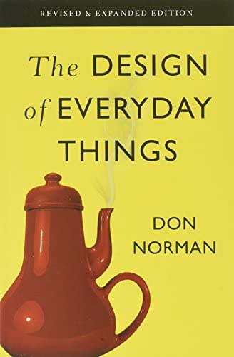

# HCI perspective

**Are programming languages user interfaces?**

--------

The means by which the user and a computer system interact (...)

**Shifts focus on users  
and interaction**

-----------------------------------------------------------------------------------------
- template: image

# Desktop metaphor

**Created in the  
1970s at Xerox**

Metaphor as a  
design principle

Move from solving problems to building new interfaces

-----------------------------------------------------------------------------------------
- template: image

# Human factors

**Equipment interaction incidents by trained users in World War II**

Design equipment  
to minimize potential for problems

Lab testing and experimental psychology

-----------------------------------------------------------------------------------------
- template: icons

# Research methods
## What to study and how

- *fa-stopwatch* What is the most effective way of doing X?
- *fa-heart-crack* What mistakes programmers make and why?
- *fa-filter* Can we solve X and Y in a unified way?
- *fa-vr-cardboard* Do systems enable new user experiences?

-----------------------------------------------------------------------------------------
- template: lists
- class: smaller

# Methodological bias

## Hierarchy in science

- Theoreticians over experimentalists
- Everyone knows Einstein's equation
- Nobody Michelson–Morley experiment

## Biases in computing

- Proofs are the most fundamental!
- Can we measure something objective?
- Running a rigorous user experiment?
- All other evaluation is "too soft"!

*****************************************************************************************
- template: subtitle

# Controlled experiments
## Evidence-based language design

-----------------------------------------------------------------------------------------
- template: image

# Evidence-based language design

For each language feature, determine  
the best option experimentally

**How to make user studies as rigorous  
as possible?**

-----------------------------------------------------------------------------------------
- template: lists
- class: smaller

# Randomized controlled trials

## Gold standard in medicine

- Compare treatments or with placebo
- Random allocation of participants
- Blinding and study pre-registration

## Limitations of RCTs

- Very hard to do properly
- Answers only very limited questions
- Even this may not be rigorous enough!

-----------------------------------------------------------------------------------------
- template: content
- class: randomo noborder

# Case study: Perl vs. Randomo

An Empirical Investigation into Programming Language Syntax (Steffik, Siebert, 2013)

-----------------------------------------------------------------------------------------
- template: lists

# Getting it right

## Study setup

- Copy and modify code sample
- Never programmed before
- Age, gender, language balance

## Statistical evaluation

- Verified manual rating of accuracy
- Mauchly's sphericity test
- Repeated-measures ANOVA test

-----------------------------------------------------------------------------------------
- template: image
- class: noborder smaller

# Perl vs. Randomo

While users of Quorum were able to program statistically significantly more
accurately than users of Perl (p = .047), and users of Randomo (p = .004),
Perl users were not able to program significantly more accurately than Randomo users (p = .458).

-----------------------------------------------------------------------------------------
- template: icons

# Experiments
## Studying languages experimentally

- *fa-not-equal* Typing discipline, syntax, errors, inheritance
- *fa-shield-halved* Compare two structurally similar alternatives
- *fa-users* Study participants with similar backgrounds
- *fa-puzzle-piece* Does not help with fundamentally new designs

*****************************************************************************************
- template: subtitle

# Empirical studies
## Software repository analysis

-----------------------------------------------------------------------------------------
- template: lists

# Software repository analysis

## Study existing codebases

- Lots of projects on GitHub
- Commit history, bug reports, etc.

## What can we study?

- What leads to fewer bugs?
- How OSS contributors behave
- How code gets duplicated and reused?
- Code quality and code structure

-----------------------------------------------------------------------------------------
- template: image
- class: smaller

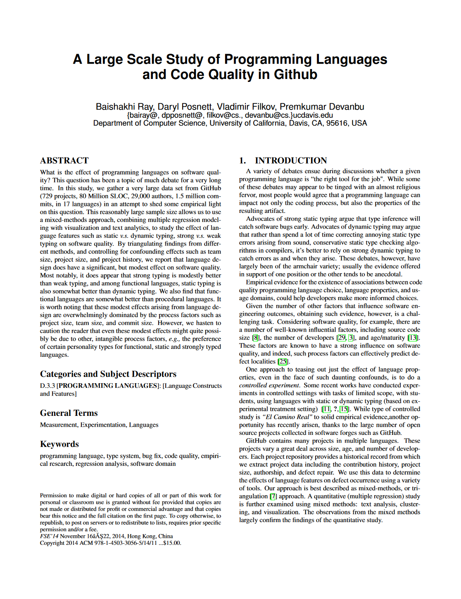

# Does strong typing matter?

**Large scale corpus study**

-----

"[It] appear[s] that "strong typing is modestly better
than weak typing, and among functional languages, static
typing is also somewhat better than dynamic typing.""

-----------------------------------------------------------------------------------------
- template: image

# Does strong typing matter?

**Attempt to reproduce the study mostly failed**

"I believe [it does] in my heart of hearts, but it's kind of an impossible experiment to run."

-----------------------------------------------------------------------------------------
- template: icons

# Repository analysis
## How to and limitations

- *fa-dumpster* Lots of code on GitHub is useless
- *fa-images* Focus on somewhat sensible projects!
- *fa-user-secret* Many hidden factors to account for
- *fa-scale-balanced* Avoid comparing apples and oranges
- *fa-play* Studying semantics and runtime is hard

*****************************************************************************************
- template: subtitle

# Usability evaluation
## Considered harmful

-----------------------------------------------------------------------------------------
- template: image

# Cultural adoption

(Greenberg et al. 2008)

"Usability evaluation is appropriate for settings with well-known
tasks and outcomes. They fail to consider how novel systems will evolve
and be adopted by a culture over time."

-----------------------------------------------------------------------------------------
- template: lists

# Tricky to evaluate

## Early designs

- Purely explorative sketches
- Getting the right design vs.  
  Getting the design right

## Cultural adoption

- Hard to imagine future uses
- First radio and automobiles
- Memex, Sketchpad and oNLine System

-----------------------------------------------------------------------------------------
- template: image

# Evaluating user interface research

(Olsen, 2007)

**Lively research field in the 1970s and 1980s**

Ubiquitous computing challenges the classic desktop metaphor

**Increasing number  
of non-expert programmers!**

-----------------------------------------------------------------------------------------
- template: icons

# User interfaces
## New system and languages

- *fa-stopwatch* Reduce time to create new solutions
- *fa-traffic-light* Least resistance to good solutions
- *fa-spoon* Lowering skills barrier of users
- *fa-plug* Power in common unified infrastructure

*****************************************************************************************
- template: subtitle

# Simplifying programming
## Data exploration tools

-----------------------------------------------------------------------------------------
- template: image

# Programming for data journalists

----

Data transformations using various online data sources

Too hard for Excel, too complex in Python or R

**Getting it right is very time-consuming!**

-----------------------------------------------------------------------------------------
- template: subtitle

# Demo
## Data exploration in The Gamma

-----------------------------------------------------------------------------------------
- template: image
- class: noborder

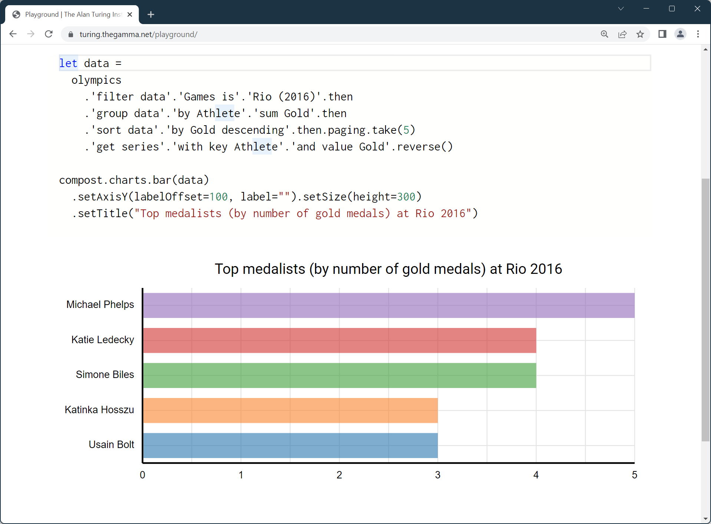

# Evaluating  The Gamma

**Can non-experts actually use it?**

Is it better than spreadsheets?

**What desirable  
design characteristics does it have?**

-----------------------------------------------------------------------------------------
- template: lists
- class: smaller

# Case study: The Gamma

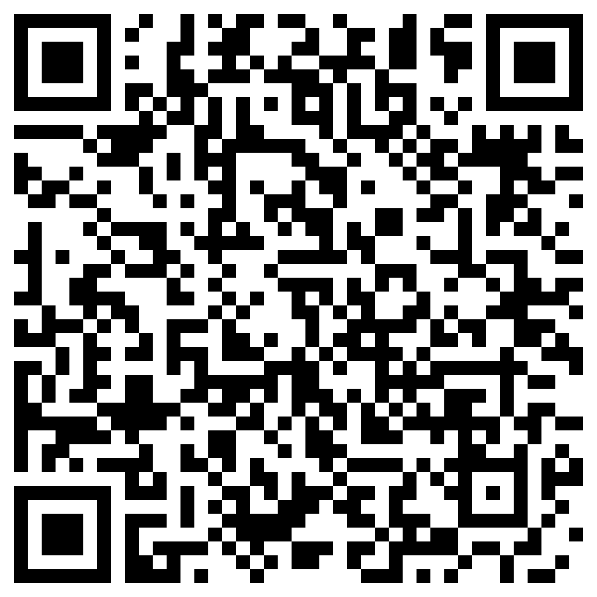

## Evaluating programming systems

- Programming tool for journalists
- Olsen's framework for UI systems
- [tinyurl.com/nprg075-ui](https://people.cs.uchicago.edu/~brianhempel/Evaluating%20User%20Interface%20Systems%20Research%20-%20Graphical%20Summary.pdf)

## Design questions

- What possible claims can we make?
- What evaluation errors to avoid?

*****************************************************************************************
- template: subtitle

# Methods review
## Evaluating programming systems

-----------------------------------------------------------------------------------------
- template: image

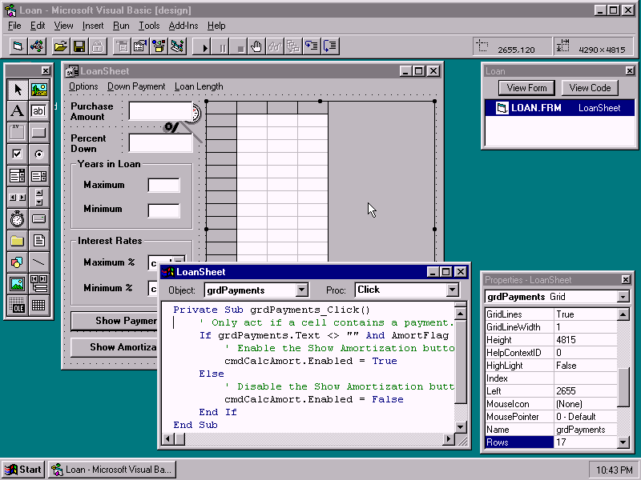

# Evaluating  HCI toolkits

(Ledo et al., 2018)

Research claims made in publications about UI toolkits, etc.

**The same works for languages, libraries, tools, frameworks, ...**

-----------------------------------------------------------------------------------------
- template: icons

# Evaluation types
## What claims can we make?

- *fa-film* **Demonstrations** - show what is possible
- *fa-keyboard* **Usage** - study actual system use
- *fa-chart-simple* **Performance** - evaluate how well it runs
- *fa-thumbs-up* **Heuristics** - expert rules of thumb

-----------------------------------------------------------------------------------------
- template: content
- class: three-column

# Demonstrations

### *fa-city* Showing novel example

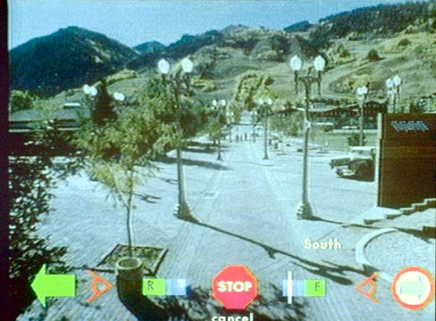

Can do some-thing previously unthinkable

-----

### *fa-city* Replicating past example

System makes previously very hard thing easy

-----

### *fa-city* Conducting case studies

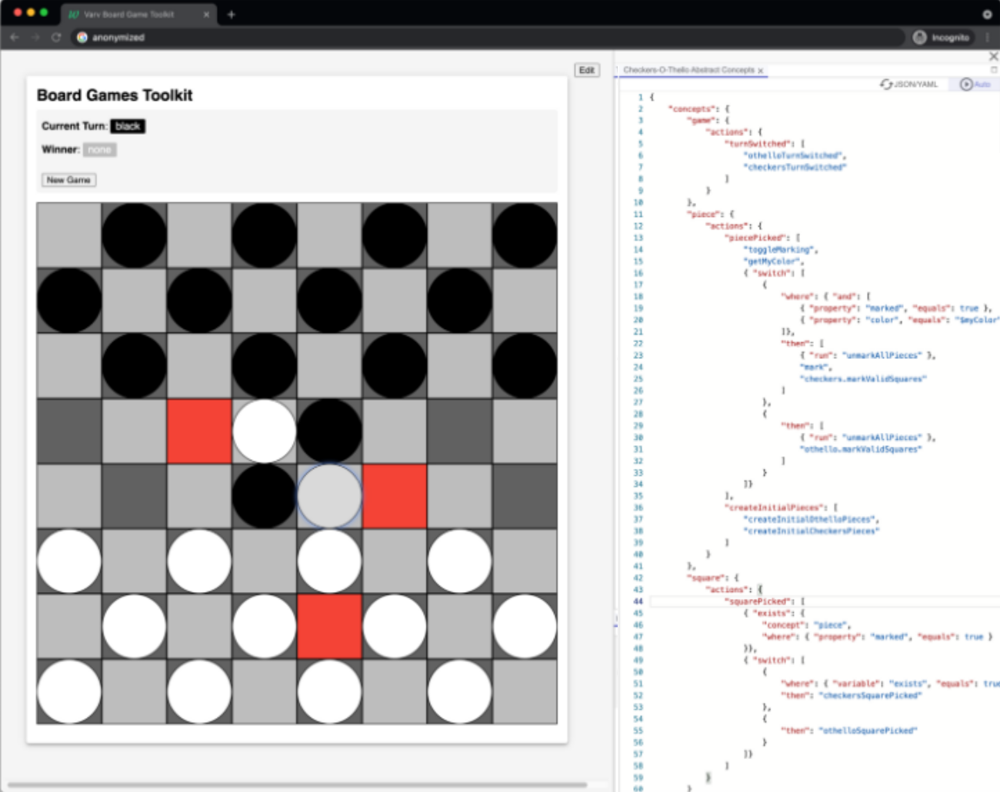

Show usability of a system in a range of situations

-----------------------------------------------------------------------------------------
- template: image
- class: smaller

# Demo or Die!

**MIT Media Lab paraphrasing of  
"publish or perish".**

Aspen Movie Map  
The 1978 precursor of Google Street View

**Demo shows radically  
new technology**

-----------------------------------------------------------------------------------------
- template: image

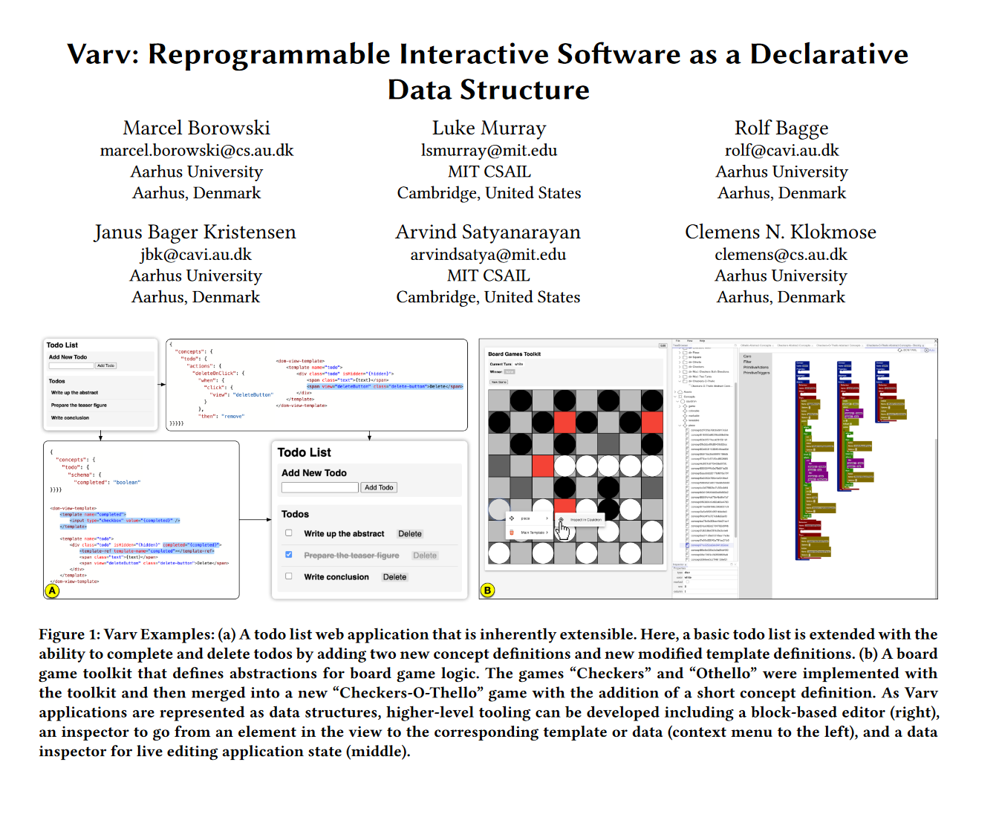

# Varv programming system evaluation

(Borowski et al., 2022)

Makes all information visible and modifiable

Affects the whole developer workflow

**Case studies to illustrate the effects**

-----------------------------------------------------------------------------------------
- template: lists

# Varv evaluation

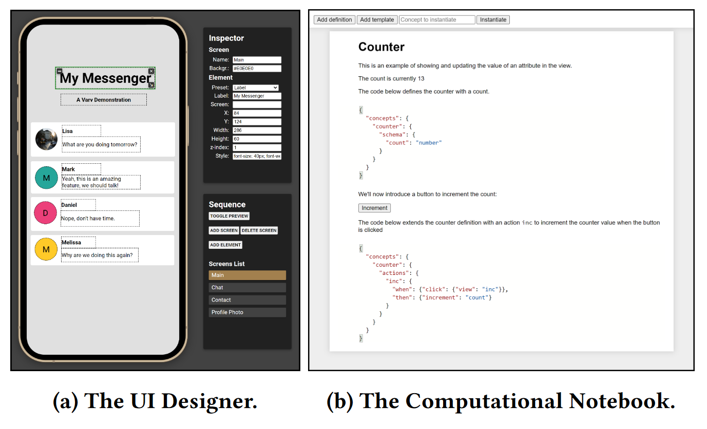

## Demonstrate workflow

- Two concrete usage scenarios
- Step by step description of work
- Using personas for concreteness

## Potential of the system

- Implications of the design
- Debugging, authoring, tools
- Notebooks, blocks, VS Code, etc.

-----------------------------------------------------------------------------------------
- template: image

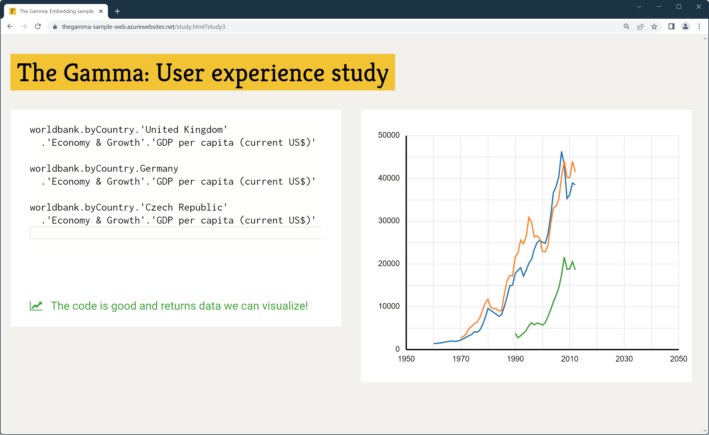

# Usage evaluation of The Gamma

(Petricek, 2022)

**Can non-programmers really use the system?**

Get non-programmers, ask them to try and watch and note!

-----------------------------------------------------------------------------------------
- template: image

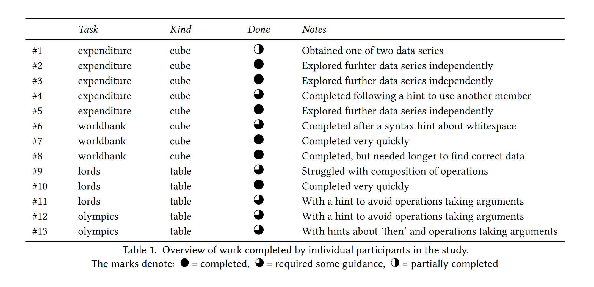

# The Gamma evaluation

**13 participants from business team of a research institute**

Asked to complete  
1 of 4 different tasks

Evaluated using activity logging, observation and interview

-----------------------------------------------------------------------------------------
- template: lists

# Usage evaluation

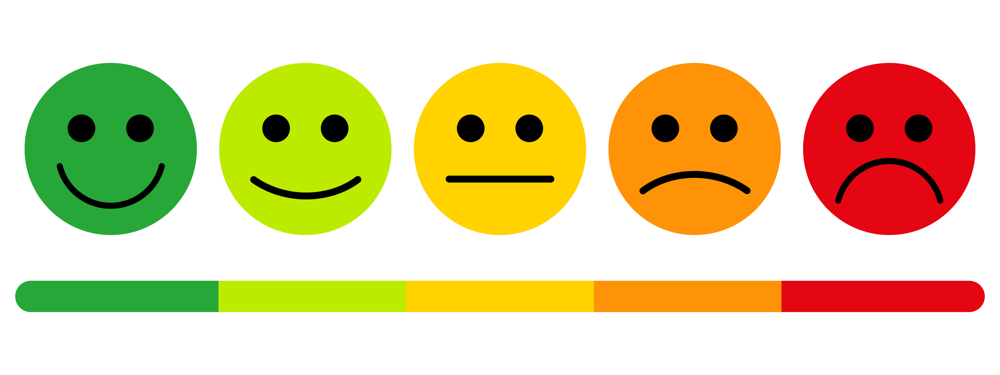

## Possible setup

- Complete a given task
- Observe, log & record
- A/B comparison of variants
- In the lab or in the wild

## Collecting feedback

- Complete a questionnaire
- Ask to comment (Think aloud)
- Semi-structured interview afterwards

-----------------------------------------------------------------------------------------
- template: image

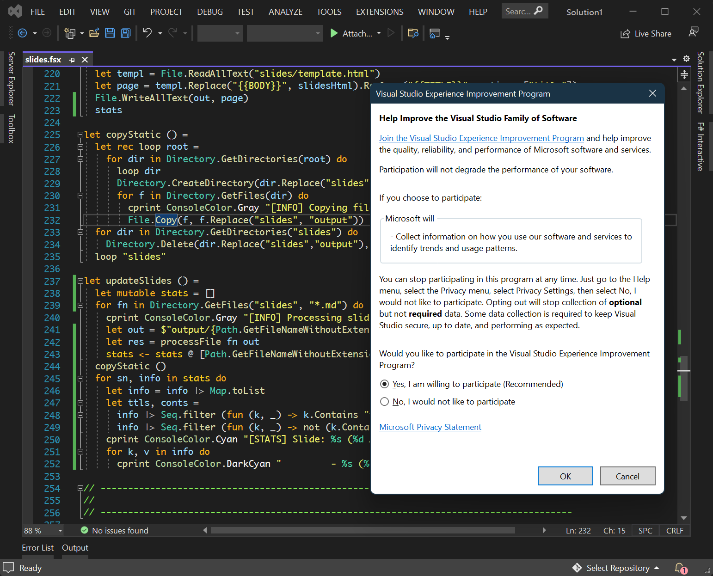

# Studying usage in the wild

**Widely used to understand use of commercial systems**

What language or editor features are used, performance, project profiles

-----------------------------------------------------------------------------------------
- template: image
- class: noborder smaller

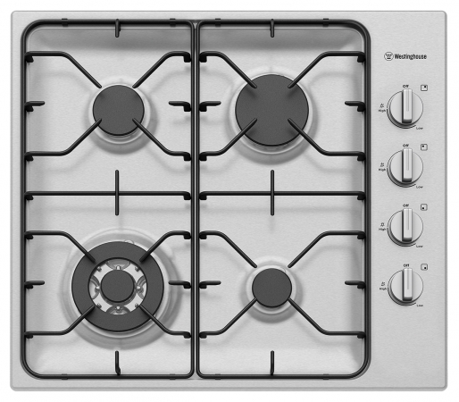

# Heuristics

**Rules of thumb for evaluating designs  
written by experts**

Evaluation without direct human involvement!

Example: Match between system and the real world

**Olsen's criteria for user interface systems**

-----------------------------------------------------------------------------------------
- template: lists
- class: smaller

# Heuristics

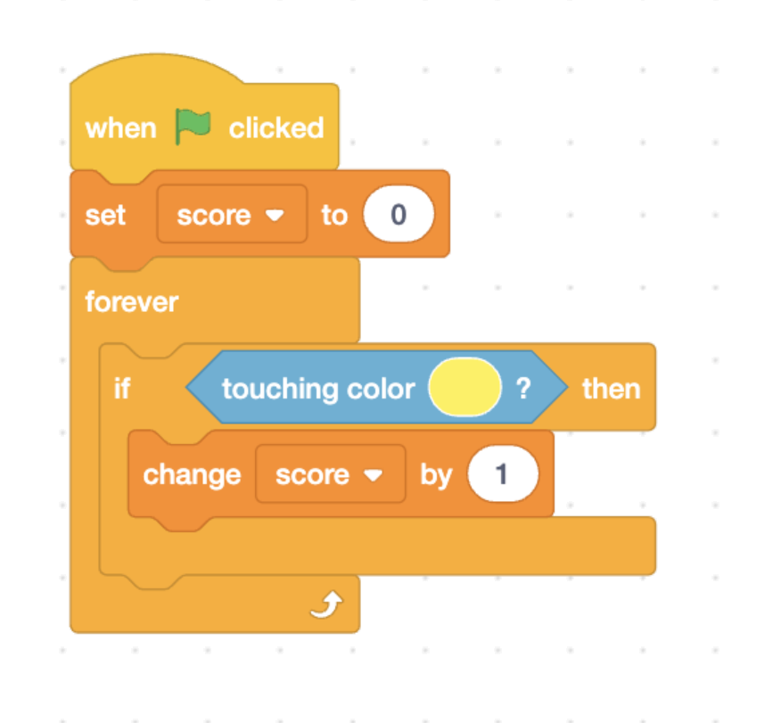

## Nielsen's usability heuristics

- Characteristics of a good interface
- General usability guidelines
- Consistency, visibility of state, ...

## Cognitive dimensions of notation

- Heuristics for assessing notations
- Broad-brush understandable evaluation
- Viscosity, visibility, abstraction, ...

-----------------------------------------------------------------------------------------
- template: image

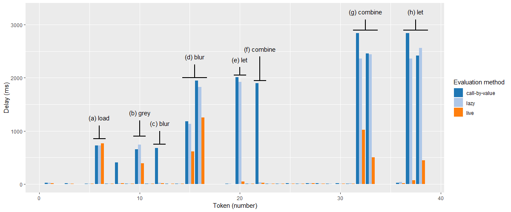

# Technical performance

**Baseline or improves over state of the art**

Efficiency, lines of code

Not about usability, but an easy thing to show

-----------------------------------------------------------------------------------------
- template: image

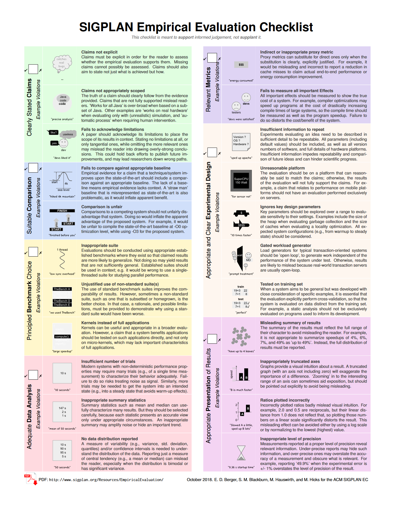

# Technical performance

**Getting it right**

Claims, comparison, benchmarks, metrices, setup, presentation

See SIGPLAN Empirical Evaluation Checklist

*****************************************************************************************
- template: subtitle

# Conclusions
## Usability and evaluation

-----------------------------------------------------------------------------------------
- template: image
- class: smaller

# Usability evaluation

**Evaluating and comparing with existing systems**

Evaluating usability can inspire new designs

The danger is designing with focus just on  
effective evaluability

-----------------------------------------------------------------------------------------
- template: lists
- class: smaller

# Reading

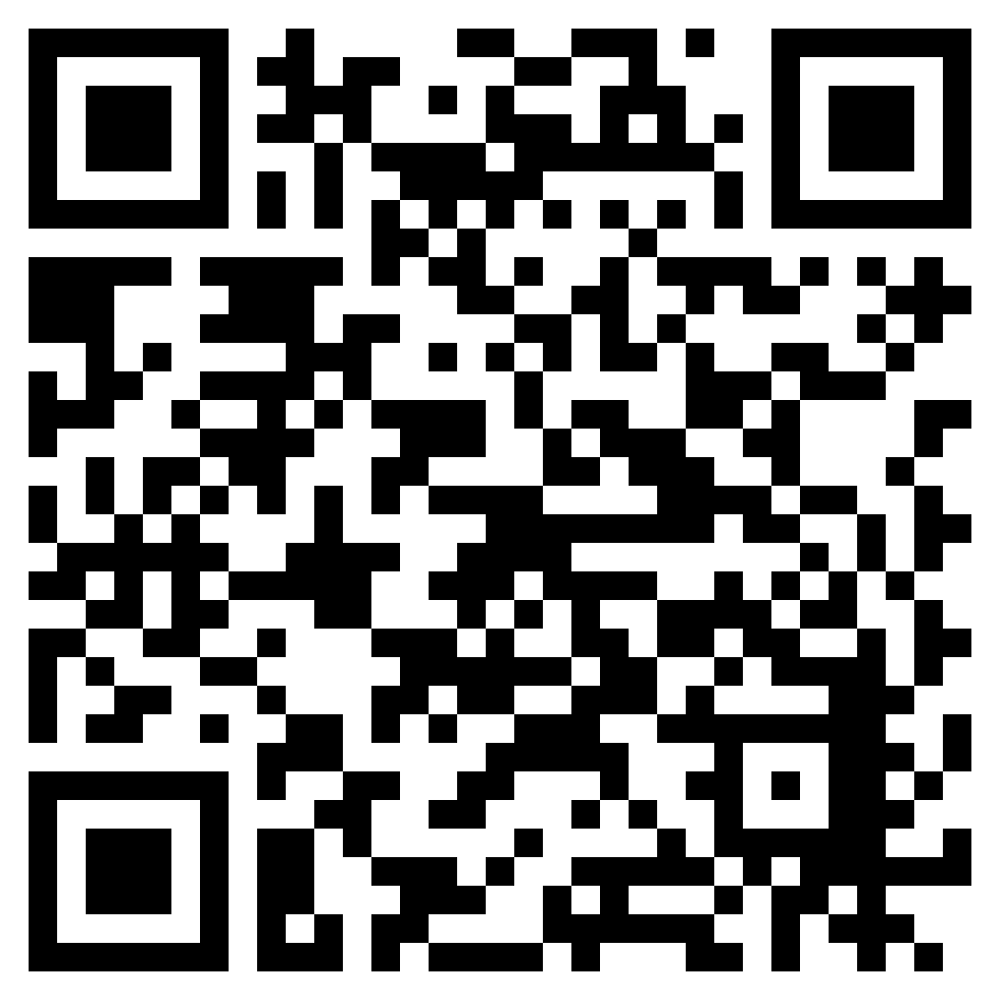

## Reactive programming

- Introduction to RxJS concepts
- Available at: https://www.learnrxjs.io/learn-rxjs/concepts/rxjs-primer

## Why read this

- Widely used practical library!
- But what exactly is going on?
- Does it always behave "intuitively"?

-----------------------------------------------------------------------------------------
- template: title

# Conclusions

**Human-centric language design**

- Evaluation methods from the HCI field
- Controlled experiments, empirical studies
- Demos, usage, heuristics & performance

---

**Tomáš Petříček**, 309 (3rd floor)  
_<i class="fa fa-envelope"></i>_ [petricek@d3s.mff.cuni.cz](mailto:petricek@d3s.mff.cuni.cz)  
_<i class="fa-solid fa-circle-right"></i>_ [https://tomasp.net](https://tomasp.net) | [@tomaspetricek](http://twitter.com/tomaspetricek)  
_<i class="fa-solid fa-circle-right"></i>_ https://d3s.mff.cuni.cz/teaching/nprg075

-----------------------------------------------------------------------------------------
- template: content
- class: condensed

# References (1/2)

**Methodology**

- Greenberg, S. and Buxton, B. (2008) [Usability Evaluation Considered Harmful (Some of the Time)](https://www.billbuxton.com/usabilityHarmful.pdf), CHI
- Ledo et al. (2018). [Evaluation Strategies for HCI Toolkit Research](https://stevenhouben.be/pubs/EvaluationCHI2018.pdf)
- Olsen (2007). [Evaluating User Interface Systems Research](http://byu.danrolsenjr.org/paperPDFs/EvaluatingSystems.pdf). UIST
- Arnold, K. (2005). [Programmers are People, Too](https://queue.acm.org/detail.cfm?id=1071731), ACM Queue

**Heuristics**

- Nielsen, J. (1994). [10 Usability Heuristics for User Interface Design](https://www.nngroup.com/articles/ten-usability-heuristics/). Norman-Nielsen Group
- Blackwell, A., Green, T. (2002). [Notational Systems – the Cognitive Dimensions of Notations framework](https://www.cl.cam.ac.uk/~afb21/publications/CarrollChapter.pdf). (Chapter)
- Berger, E. et al. (2022). [SIGPLAN Empirical Evaluation Checklist](https://raw.githubusercontent.com/SIGPLAN/empirical-evaluation/master/checklist/checklist.pdf). ACM SIGPLAN

-----------------------------------------------------------------------------------------
- template: content
- class: condensed

**Examples**

- Steffik, A. et al. (2013). [An Empirical Investigation into Programming Language Syntax](https://www.vidarholen.net/~vidar/An_Empirical_Investigation_into_Programming_Language_Syntax.pdf). ACM
- Ray, B. et al. (2014) [A Large Scale Study of Programming Languages and Code Quality in Github](https://web.cs.ucdavis.edu/~filkov/papers/lang_github.pdf), FSE
- Berger, E. et al. (2019) [On the Impact of Programming Languages on Code Quality](https://arxiv.org/pdf/1901.10220.pdf), ACM
- Borowski, M. et al. (2022). [Varv: Reprogrammable Interactive Sofware as a Declarative Data Structure](http://vis.csail.mit.edu/pubs/varv.pdf). CHI
- Petricek, T. (2022). [The Gamma: Programmatic Data Exploration for Non-programmers](http://tomasp.net/academic/papers/iterative/iterative.pdf). VL/HCC

**Books**

- Norman, D. (1988). [The Design of Everyday Things](https://www.basicbooks.com/titles/don-norman/the-design-of-everyday-things/9780465050659/), Basic Books
- Hacking, I. (1983). [Representing and Intervening](https://www.cambridge.org/en/academic/subjects/philosophy/philosophy-science/representing-and-intervening-introductory-topics-philosophy-natural-science), Cambridge
